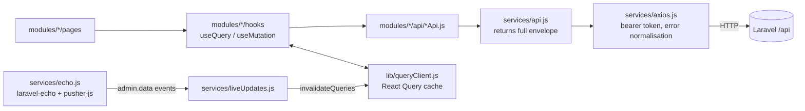

# Admin Web Frontend Architecture

React 19 SPA (plain JS/JSX, React Compiler on) built with Vite 8. Relative imports only (no `@/`
alias). Served as static files ([[Frontend Hosting]]).

## Data flow

- **Rule:** feature code calls `services/api.js`, never the raw axios instance (CLAUDE.md).
  *Exception found:* `modules/analytics/api/analyticsApi.js` and
  `modules/dataManagement/api/dataManagementApi.js` import `services/axios` directly to download
  blobs (CSV). See [[Known Issues and Gaps]].
- **Query keys** live in `QUERY_KEYS` (`src/constants/index.js`).
- **Query defaults:** `staleTime` 60 s, `gcTime` 5 min, no refetch on focus, no retry for HTTP
  errors (retry ×3 with backoff only for network errors); mutations never retry.

## Authentication in the SPA

- `AuthProvider` stores the token via `useLocalStorage` under `skillserve:token` (JSON-encoded) and
  hydrates the user from `GET /auth/me` (`staleTime: Infinity`). Login seeds the `me` cache from the
  login response.
- The axios request interceptor reads the token from `localStorage` and adds
  `Authorization: Bearer …`. A 401 (except on `/auth/login`) clears the token and dispatches
  `skillserve:unauthorized`, which logs the user out.
- Error normalisation: every rejection is `{status, message, errors, data}`; offline → "No internet
  connection…", timeout (120 s) → "Request timed out…", 429 → "Too many attempts…".
- When authenticated, `connectRealtime(token)` opens Echo, subscribes to
  `App.Models.User.{id}` (`.client.notification.created`) and starts live updates.

## Routing and guards (`src/routes/index.jsx`)

| Guard | Behaviour |
|---|---|
| `GuestOnly` | `/login`, `/forgot-password`, `/reset-password`; signed-in users go to `/admin` |
| `RequireAuth` | everything under `/admin` (inside `AdminLayout`) |
| `RequirePermission permissions=[…]` | shows `AccessDenied` unless the user is super-admin or holds **any** listed permission |
| `RequireRole` | exists, not used by the route table |

`/` redirects to `/login`. Pages are lazy-loaded from `routes/lazyPages.jsx`. Full route list:
[[Admin Web Navigation Map]].

## Permissions in the UI

`utils/permissions.js`: `hasCapability(user, permission, managePermission)` — super-admin ⇒ true;
otherwise the permission or the module's `manage …` permission. `hasAnyCapability` is used by
`AdminLayout` to build the sidebar. Permission strings match backend Spatie names
([[Permission Catalog]]).

## Live updates (`services/liveUpdates.js`)

- Listens on private channel `admin.data`, event `.admin.data.changed` carrying
  `{ resources: [...] }`.
- Maps each resource to query keys (e.g. `bookings` → bookings + disputes) and always refreshes
  dashboard + analytics; bursts batched for 300 ms.
- If the socket is not live: polls every **15 s** while the tab is visible, and refreshes on tab
  focus; after reconnecting, refreshes everything.

## Configuration (`src/app/config.js`)

| Setting | Source | Fallback |
|---|---|---|
| API base URL | `VITE_API_BASE_URL` | `http://localhost:8000/api` on localhost; else `<page protocol>//<page host>:8000/api` |
| Reverb key | `VITE_REVERB_APP_KEY` | hard-coded `5854c89d…` (see [[Known Issues and Gaps]]) |
| Reverb host/port/scheme | `VITE_REVERB_HOST/PORT/SCHEME` | page host (`localhost` → `127.0.0.1`), 8080, page scheme |

## Build

- Production-only **CSP meta tag** injected by a Vite plugin (`script-src 'self'`,
  `connect-src 'self' https: wss:`, `img-src 'self' data: blob: https:` …).
- Chunks: route pages lazy; `react` and `realtime` (laravel-echo, pusher-js) vendor groups.
- `vercel.json` rewrites everything to `index.html` (a Vercel config exists alongside the Render
  static-site instructions — see [[Frontend Hosting]]).

## Shared UI building blocks

`components/common` (EmptyState, ErrorState, FullScreenLoader, OfflineBanner, PageSkeleton,
SearchInput), `components/feedback` (ConfirmDialog, ErrorBoundary, OfflineBanner, Toaster),
`components/forms/FormField`, `components/tables` (DataTable, Pagination), `components/ui` (Badge,
Button, Card, Input, Modal, Skeleton, Spinner, Textarea). See [[Admin Web UI System]].

## Related

[[Admin Web Navigation Map]] · [[Frontend Development Guide]] · [[Frontend-to-API Map]]
