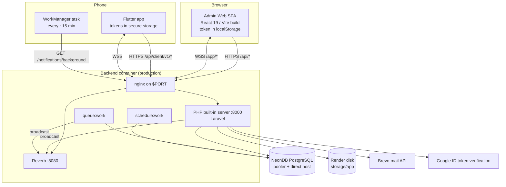

# Architecture Overview

SkillServe is a **monolithic Laravel API** with two separate clients: a React admin SPA and a
Flutter mobile app ([[ADR-001 Monolith with Separate Mobile Client]]). One PostgreSQL database; one
backend process tree per environment (web server, Reverb, queue worker, scheduler).

## Components

In production a **single container** runs everything behind nginx (`deploy/render/start.sh`,
`deploy/render/nginx.conf`); WebSocket traffic is routed to Reverb and the rest to Laravel. Locally,
Docker Compose runs four containers with host networking ([[Docker Compose Local Stack]]).

## API surfaces

| Surface | Prefix | Clients | Token | Guarding middleware |
|---|---|---|---|---|
| Admin API | `/api/*` | Admin Web | `admin-session` (abilities `*`) | `auth:sanctum` + policies/gates per action |
| Client API | `/api/client/v1/*` | Mobile | `client-access` (`client:auth`), 60 min | `EnsurePlatformAvailable`, `auth:sanctum`, `EnsureClient` / `EnsureProvider` / `EnsureMobileAccount` / `EnsureActiveClient` |
| Background | `/api/client/v1/notifications/background` | WorkManager | background token (`client:notifications`) | `EnsureBackgroundNotificationToken` |
| Realtime auth | `/api/broadcasting/auth` | both | either | `auth:sanctum` + channel callbacks |
| Public | `/api/health`, `/up`, `/api/client/v1/platform`, catalog GETs | anyone | none | `throttle:api` |

Details: [[API Conventions]], [[Authentication Flows]].

## Trust boundaries

1. **Admin web ↔ API** — bearer token in `localStorage` (`skillserve:token`); CORS restricted to known
   origins ([[CORS and Security Headers]]); CSP meta tag in production builds.
2. **Mobile ↔ API** — short-lived access token + rotating refresh token in platform secure storage.
3. **API ↔ DB** — Neon over TLS (`DB_SSLMODE=require`); migrations use the direct host.
4. **Private files** — verification documents and dispute evidence are never served publicly;
   admins stream them through authorized endpoints ([[File Upload Security]]).

## Cross-cutting design

- **Response envelope** `{ success, message, data, errors, meta }` everywhere
  ([[API Conventions]]).
- **Events → listeners** for audit logging and notifications, registered manually in
  `AppServiceProvider` ([[Backend Architecture]]).
- **Realtime "data changed" signals** keep admin pages fresh; per-user channels push mobile
  notifications and chat ([[Realtime Architecture]]).
- **Settings-driven behaviour** — commission, booking pause, cancellation fees, maintenance mode,
  session timeout, page size ([[System Settings Catalog]]).

## Related

[[Backend Architecture]] · [[Admin Web Frontend Architecture]] · [[Mobile App Architecture]] ·
[[Deployment Index]]
