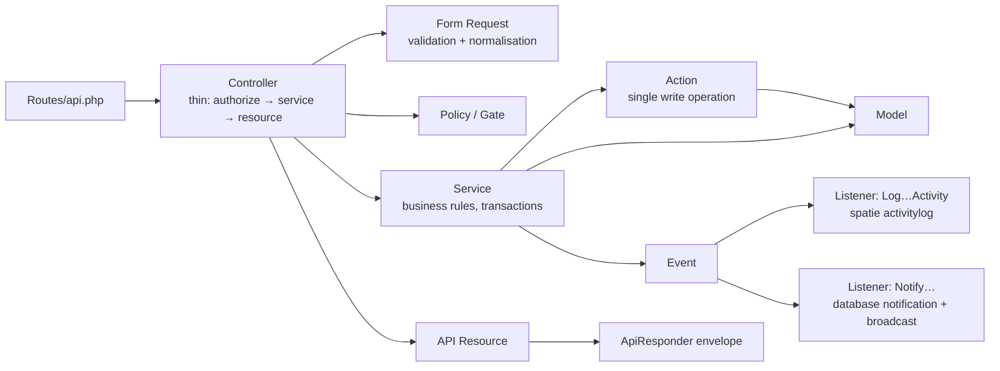

# Backend Architecture

Laravel 13 API in `backend/`. No Blade UI beyond the default `welcome` view on `/`.

## Layers inside a module

Modules are **plain PSR-4 namespaces** under `App\Modules\<Name>` (`composer.json` maps
`App\Modules\` → `app/Modules/`). `nwidart/laravel-modules` is installed but not used for layout
([[ADR-002 Modules as Plain Namespaces]]).

Typical folder set: `Actions, Controllers, Events, Listeners, Models, Notifications, Policies,
Requests, Resources, Routes, Services, Tests/Feature`.

## The 21 modules

| Module | Surface | Main models | Feature note |
|---|---|---|---|
| Authentication | admin `/api/auth` | (User) | [[Admin Authentication]] |
| Dashboard | admin | — (aggregates) | [[Admin Dashboard]] |
| Administrators | admin | Role, Permission (Spatie), User | [[Admin Management]] |
| Users | admin | User | [[User Management]] |
| ServiceCategories | admin | ServiceCategory, ServiceSubcategory | [[Service Category Management]] |
| Providers | admin | ProviderProfile, VerificationRequest, VerificationDocument, ProviderPortfolioItem, ProviderAvailability | [[Service Provider Management]] |
| Services | admin | Service | [[Service Management]] |
| Bookings | admin (bookings + disputes) | Booking | [[Booking Management]] · [[Dispute Management]] |
| Reviews | admin | Review | [[Reviews and Ratings Management]] |
| ReportsAndModeration | admin | Report, Message | [[Reports and Moderation]] |
| Notifications | admin | Announcement | [[Notifications and Announcements]] |
| Analytics | admin | — | [[Reports and Analytics]] |
| ProviderRecognition | admin | ProviderBadge | [[Provider Recognition]] |
| Audit | admin | Activity (spatie) | [[Security and Audit Logs]] |
| Settings | admin + public `/platform` | Setting | [[System Settings]] |
| DataManagement | admin | DataArchive | [[Data Management]] |
| Support | admin | SupportTicket, SupportTicketMessage | [[Support Management]] |
| ClientAuthentication | mobile `/auth` | ClientRefreshToken, PendingRegistration | [[Client Authentication and Account]] |
| ClientMarketplace | mobile catalog, bookings, provider self-service | (reuses admin models) | [[Client Booking]] · [[Provider Jobs]] |
| ClientCommunication | mobile messages, notifications, reports, support | (reuses Message, Report, SupportTicket) | [[Client Messaging]] |
| ClientPreferences | mobile preferences | ClientPreference | [[Client Settings and Preferences]] |

Client modules **reuse** admin-side models and actions (e.g. `ProviderServiceService` calls the
Services module's `CreateServiceAction`/`UpdateServiceAction`). See [[Module Relationship Map]].

## Manual wiring (no auto-discovery)

| What | Where |
|---|---|
| Admin module routes | `routes/api.php` includes each `app/Modules/<X>/Routes/api.php` (auth under `/api/auth`) |
| Client routes | `ClientMarketplaceServiceProvider` mounts ClientAuthentication (`/auth`), ClientMarketplace, ClientCommunication, ClientPreferences under `api/client/v1` with `EnsurePlatformAvailable`; `/platform` is mounted **outside** it so the app can poll during maintenance |
| Service providers | `bootstrap/providers.php`: `AppServiceProvider`, `ClientMarketplaceServiceProvider` |
| Policies, gates, listeners, rate limiters, Sanctum token check, Brevo transport | `AppServiceProvider::boot()` |
| Broadcast channels | `routes/channels.php` (prefix `api`, middleware `api, auth:sanctum`) |
| Schedule | `routes/console.php` |

## Shared layer — `app/Shared`

| Piece | Purpose |
|---|---|
| `Services/ApiResponder`, `Traits/ApiResponse` | build the `{success,message,data,errors,meta}` envelope |
| `Exceptions/ApiException` | throwable carrying status, errors, meta → rendered as envelope |
| `Exceptions/AccountRestrictedException` | 403 with `meta.account {status, reason, since, until}` |
| `Middleware/ForceJsonResponse` | every `api/*` response is JSON |
| `Middleware/CacheApiResponse` | ETag + `Cache-Control: private, no-cache` on GET; 304 support |
| `Middleware/AddRateLimitHeaders` | `X-RateLimit-*` headers |
| `Middleware/EnsurePlatformAvailable` | 503 + `meta.maintenance` when maintenance mode is on (mobile only) |
| `Middleware/EnsureSwaggerUiEnabled` | hides Swagger in production unless `SWAGGER_UI_ENABLED=true` |
| `Realtime/RealtimeChangeTracker`, `AdminDataChanged` | collect model changes per request/job; broadcast once on `admin.data` |
| `Helpers/BusinessTime` | UTC storage ↔ Asia/Manila wall clock |
| `Helpers/PageSize` | `per_page` or System Settings default, clamped 1–100 |
| `Services/BrevoApiTransport` | mail over Brevo HTTPS API (`MAIL_MAILER=brevo-api`) |
| `Listeners/SyncUserRoleId` | keep `users.role_id` in step with Spatie role attach/detach |
| `Enums/AccountRole` | fixed role ids 1–4 |
| `Base*` classes | BaseAction, BaseService, BaseFormRequest, BaseResource(Collection), BasePolicy, BaseJob, BaseNotification; `HandlesTransactions`, `HasUuid` traits |
| `Swagger/OpenApi.php` | global OpenAPI info + shared schemas |

## Exception → envelope mapping (`bootstrap/app.php`)

| Exception | Status | Message |
|---|---|---|
| `ApiException` | its status | its message, `errors`, `meta` |
| `ValidationException` | 422 | "The given data was invalid." + field errors |
| `AuthenticationException` | 401 | "Unauthenticated." |
| `QueryException` | 500 | "A database error occurred." (no SQL leaked) |
| `NotFoundHttpException` (incl. model not found) | 404 | "Resource not found." |
| `AccessDeniedHttpException` (incl. policy denial) | 403 | "This action is unauthorized." |
| other `HttpException` | its status | its message |
| anything else | 500 | "Server Error." |

Only requests to `api/*` or expecting JSON get the envelope.

## Console commands

`users:unban-expired` (every minute), `data-management:purge-expired` (daily), `db:seed-if-empty`
(container start). See [[Background Jobs and Scheduling]].

## Related

[[Request Lifecycle]] · [[Backend Development Guide]] · [[Authorization and RBAC]]
