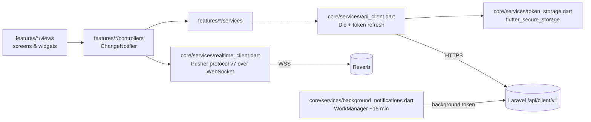

# Mobile App Architecture

Flutter app (Android is the release target; app id `com.skillserve.mobile`, label "SkillServe").
It only talks to `/api/client/v1/*` and Reverb — never admin endpoints, never the database.

## Layers

- **State:** `provider` package; `main.dart` registers `AuthController` plus proxies
  (`PreferencesController`, `DiscoveryController`, `FavoritesController`) and controllers for
  marketplace, booking, provider booking, notifications, chat, portfolio, provider services,
  payments, reports, reviews, support.
- **Navigation:** `go_router`; one route table (`lib/routes/app_router.dart`), initial location
  `/splash`.

## Two apps in one (role shells)

`redirectFor(path, isClient, isProvider)` classifies the **first path segment**:

| Set | Examples | Access |
|---|---|---|
| `_customerOnly` | `client`, `booking-form`, `booking-history`, `favorites`, `payments`, `write-review`, `my-reviews` | customers |
| `_providerOnly` | `provider`, `provider-onboarding`, `booking-requests`, `active-jobs`, `completed-jobs`, `calendar`, `earnings`, `my-services`, `add-service`, `availability`, `portfolio`, `provider-badges`, `verification-status`, `statistics` | providers |
| `_sharedSignedIn` | `notifications`, `chat-conversation`, `booking-details`, `file-report`, `my-reports`, `support`, `edit-profile`, `change-password`, account/settings screens | both roles |
| `_marketplace` | `browse`, `categories`, `search`, `service-details`, `provider-profile`, `portfolio-gallery` | guests + customers (providers redirected) |
| `_signedOutOnly` | `''`, `login`, `register`, `welcome`, `onboarding` | signed out |

Signed-out users hitting a protected route go to `/login`; signed-in users hitting the other role's
route go to their own home (`/client` or `/provider`). Unverified users are held on `/verify-email`.
This implements the owner's rule that provider and customer UIs stay separate
([[ADR-017 Separate Customer and Provider Shells]]). Full route list: [[Mobile Navigation Map]].

## Session handling

- Tokens (access, refresh, background) live in **flutter_secure_storage** (Keystore/Keychain); older
  builds' SharedPreferences tokens are migrated once. The cached account stays in
  SharedPreferences.
- `ApiClient` adds the bearer token; on 401 it runs **one shared refresh** (concurrent 401s wait on
  it, because the backend revokes the whole family if a rotated token is reused) and replays the
  request. Only a refused refresh clears the session and calls `onSessionRevoked` (with the
  suspension/ban reason when present).
- Users stay signed in until they sign out or the server ends the session (refresh window 1 year
  from last use). See [[Token and Session Management]].
- A fire-and-forget request at startup wakes the free-tier Render backend; timeouts are 120 s
  receive / 90 s connect to survive cold starts.

## Realtime and notifications

- Private channel `App.Models.User.{id}`: events `client.notification.created` and
  `client.message.created` (`features/notifications/views/notification_poller.dart`).
- Presence channel `booking-chat.{bookingId}` per open conversation: members list ("in this chat")
  and `client-typing` whispers (typing timeout 5 s, resend every 3 s).
- Fallback polling of unread counts every **30 s** (`NotificationController.pollInterval`).
- Closed app: WorkManager periodic task (15 min, network required) calls
  `GET /notifications/background` with the read-only background token and posts local
  notifications. See [[Realtime Architecture]] and [[ADR-006 Closed-App Notifications via WorkManager]].

## Maintenance and connectivity

- `MaintenanceState` flips when the API returns 503 with `meta.maintenance`; `MaintenanceGate` covers
  the app and re-checks `/platform`.
- `ConnectivityGate` (connectivity_plus) handles offline.

## Configuration (`lib/core/config/app_config.dart`)

Compile-time `--dart-define`s: `API_BASE_URL` (default
`https://skillserve-web-backend.onrender.com/api`), `REVERB_APP_KEY` (default `skillserve`),
`REVERB_HOST/PORT/SCHEME` (default: API host, 443/wss for https, 8080/ws for http),
`GOOGLE_WEB_CLIENT_ID` (default is a GCP web client id in project `skillserve-508412`).
`env/local.json` and `env/production.json` set only `API_BASE_URL`.

## Related

[[Mobile Development Guide]] · [[Mobile UI System]] · [[Mobile-to-API Map]]
