# Module Relationship Map

How backend modules depend on each other (derived from `use` statements, event wiring in
`AppServiceProvider`, and shared models).

```mermaid
flowchart TB
  subgraph Mobile["Client modules (/api/client/v1)"]
    CA[ClientAuthentication]
    CM[ClientMarketplace]
    CC[ClientCommunication]
    CP[ClientPreferences]
  end
  subgraph Admin["Admin modules (/api)"]
    AUTH[Authentication]
    ADM[Administrators]
    USR[Users]
    CAT[ServiceCategories]
    PRV[Providers]
    SRV[Services]
    BKG[Bookings]
    REV[Reviews]
    RPT[ReportsAndModeration]
    NTF[Notifications]
    REC[ProviderRecognition]
    SUP[Support]
    SET[Settings]
    DM[DataManagement]
    DSH[Dashboard]
    ANL[Analytics]
    AUD[Audit]
  end
  CM -->|Booking model, BookingRules,<br/>BookingPaymentService, events| BKG
  CM -->|Create/Update/DeleteServiceAction| SRV
  CM -->|ProviderProfile, VerificationRequest| PRV
  CM -->|Review model| REV
  CM -->|ServiceCategory| CAT
  CC -->|Message, Report| RPT
  CC -->|SupportTicket| SUP
  CC -->|BookingMessagePolicy| BKG
  CA -->|ClientPreference| CP
  CA -->|User| USR
  BKG --> SET
  SRV --> SET
  NTF --> SET
  CA --> SET
  RPT -->|moderation: suspend/ban users,<br/>hide/remove reviews & messages| USR
  RPT --> REV
  DSH -.reads.-> USR & SRV & BKG & PRV & RPT
  ANL -.reads.-> USR & PRV & SRV & BKG & REV & AUD
  DM -.archives/restores/purges.-> USR & SRV & BKG & REV & RPT & CAT
  AUD -.reads activity_log written by.-> ADM & USR & PRV & SRV & BKG & REV & RPT & SUP & REC & CAT & AUTH
```

## Shared entities and who writes them

| Entity | Written by (admin) | Written by (mobile) |
|---|---|---|
| `users` | Users (moderation, edit, delete), Administrators (staff) | ClientAuthentication (register, profile, delete) |
| `provider_profiles` | Providers (verify/suspend), ProviderRecognition (featured) | ClientAuthentication (provider signup), ClientMarketplace (profile, availability flag) |
| `services` | Services (approve/reject/hide/feature/edit/delete) | ClientMarketplace (provider CRUD → pending) |
| `bookings` | Bookings (cancel, mark paid, refund, disputes) | ClientMarketplace (create, cancel, reschedule, provider transitions, raise dispute, evidence) |
| `reviews` | Reviews (hide/restore/remove), ReportsAndModeration (hide/remove) | ClientMarketplace (create/update) |
| `messages` | ReportsAndModeration (remove) | ClientCommunication (send, mark read) |
| `reports` | ReportsAndModeration | ClientCommunication (file) |
| `support_tickets` | Support (assign, respond, resolve) | ClientCommunication (create, reply) |
| `notifications` | many listeners (Notify…) | ClientCommunication (read state) |
| `settings` | Settings | — (read by many via `SettingsService`) |

## Cross-module event wiring (selected)

| Event | Listeners |
|---|---|
| `BookingStatusChanged` | `LogBookingActivity`, `NotifyBookingParticipants` |
| `BookingDisputeManaged` | `LogBookingActivity`, `NotifyDisputeParties` |
| `BookingPaymentRecorded` | `LogBookingActivity`, `NotifyPaymentParticipants` |
| `BookingRescheduled` | `LogBookingActivity`, `NotifyProviderOfReschedule` |
| `ServiceUpdated/Approved/Rejected/Hidden/Featured/Deleted` | `LogServiceActivity`, `NotifyProviderOfServiceModeration` |
| `ProviderVerification*`, `ProviderSuspended/Activated` | `LogProviderActivity`, `NotifyProviderOfAccountDecision` |
| `UserWarned/Suspended/Activated` | `LogUserActivity`, `NotifyUserOfAccountAction` |
| `UserBanned/Unbanned` | `LogUserActivity`, `SendUserModerationMail` |
| `ReviewHidden/Removed/Restored` | `LogReviewActivity`, `NotifyReviewModeration` |
| `ReportResolved/Rejected` | `LogReportActivity`, `NotifyReporterOfOutcome` |
| `SupportTicketResponseAdded/Resolved` | `LogSupportTicketActivity`, `NotifyClientSupportTicket` |
| `NotificationSent` (framework) | `BroadcastClientNotification` |
| Spatie `RoleAttached/Detached` | `SyncUserRoleId` |

## Related

[[Backend Architecture]] · [[Domain Model Overview]] · [[Entity Relationship Diagram]]
