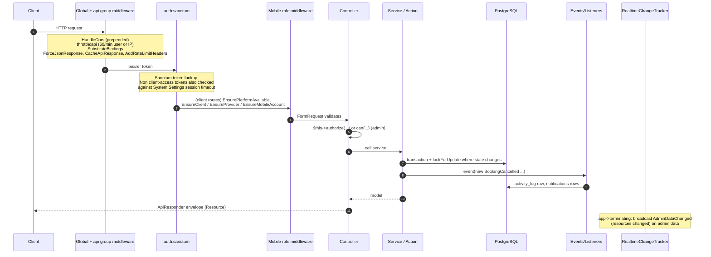

# Request Lifecycle

What happens to `PATCH /api/bookings/42/cancel` (admin) or a mobile request.

## Key details

- **Sanctum token validity** (`AppServiceProvider`): for any token whose name is not
  `client-access` (i.e. admin sessions and background tokens), the token must be younger than
  `system.session_timeout_minutes`. Admin tokens also get `expires_at` = login + timeout.
- **Rate limiters:** `api` 60/min per user id or IP; `login` `LOGIN_RATE_LIMIT`/min per IP (default
  5); `client-auth` `CLIENT_AUTH_RATE_LIMIT`/min per IP (default 20) + 10/min per email.
  `/api/health` skips `throttle:api`. See [[Rate Limiting]].
- **Maintenance mode** only affects `/api/client/v1/*` (except `/platform`); the admin API keeps
  working.
- **Concurrency:** state transitions lock the row (`lockForUpdate`) inside
  `HandlesTransactions::transaction()` (e.g. `ProviderBookingService::transition`,
  `DisputeService::lock`, `BookingPaymentService::markPaid`).
- **Idempotency:** booking creation and message sending accept an `Idempotency-Key` header, backed
  by unique indexes (`bookings_client_idempotency_unique`,
  `messages_booking_sender_idempotency_unique`).
- **Caching headers:** GET responses carry an ETag and `private, no-cache` (`API_CACHE_MAX_AGE`
  default 0); a matching `If-None-Match` returns 304.

## Related

[[Backend Architecture]] · [[API Conventions]] · [[Realtime Architecture]]
