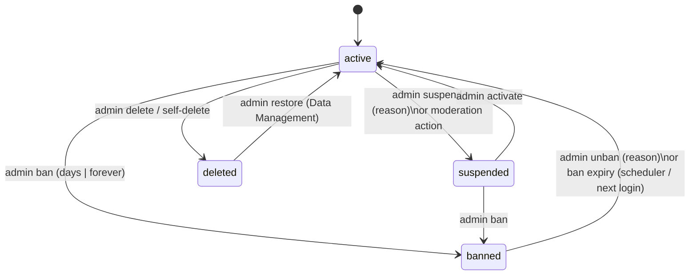

# Account Status Lifecycle

`users.status`: mobile accounts use `active, suspended, banned`; administrators use
`active, inactive`. Deletion is a **soft delete** (`deleted_at`), not a status
([[ADR-009 No Account Deactivation]]).

| Transition | Endpoint | Guards (from actions) |
|---|---|---|
| suspend | `PATCH /api/users/{u}/suspend` | not already suspended; a banned account cannot be suspended |
| activate | `PATCH /api/users/{u}/activate` | a banned account cannot be activated (use unban) |
| ban | `PATCH /api/users/{u}/ban` `{duration: days|forever, days, reason}` | not already banned; clears suspension fields; `banned_until` null = permanent |
| unban | `PATCH /api/users/{u}/unban` `{reason}` | — |
| delete | `DELETE /api/users/{u}` | not yourself; not already deleted; revokes all tokens |
| self-delete | `DELETE /api/client/v1/auth/me` `{password, reason?}` | refused while any booking is `pending/confirmed/active/disputed`; revokes all tokens |
| ban expiry | `users:unban-expired` (every minute) + on login | `banned_until` in the past |

Administrators: `PATCH /api/administrators/{id}/status {active|inactive}`; inactive admins cannot
sign in ("Your account has been deactivated…").

## What a restricted user experiences

- Every refusal (login, Google, OTP, refresh, mobile middleware) is **403** with
  `meta.account {status, reason, since, until}` (`AccountRestrictedException`).
- `/auth/me` includes `account` and the provider's suspension details.
- The app ends the session and explains why on the login screen; Settings shows an account status
  card ([[Mobile Security]]).
- Warned / suspended / reactivated users get a notification (`NotifyUserOfAccountAction`); banned /
  unbanned users get an email (`SendUserModerationMail`, best effort, gated by the email setting).

Provider suspension is separate: `provider_profiles.suspended_at` (hides the provider from the
marketplace) — see [[Provider Verification Lifecycle]].

Related: [[User Management]] · [[Data Retention and Deletion]] · [[users]]
