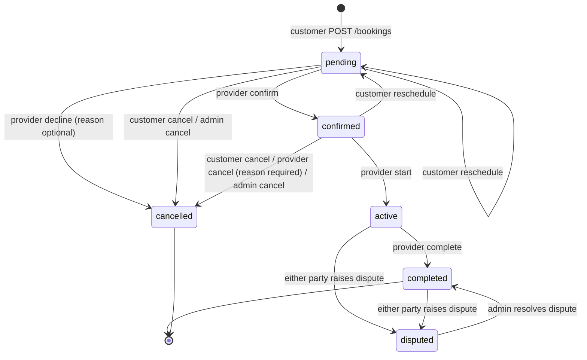

# Booking Lifecycle

`bookings.status` ∈ `pending, confirmed, active, completed, cancelled, disputed`.

| Transition | Who | Endpoint | Rule source |
|---|---|---|---|
| create → `pending` | customer | `POST /api/client/v1/bookings` | `ClientBookingService::create` |
| `pending` → `confirmed` | provider | `PATCH /provider/bookings/{id}/confirm` | `ProviderBookingService::TRANSITIONS` |
| `pending` → `cancelled` (decline) | provider | `…/decline` | same |
| `confirmed` → `cancelled` | provider | `…/cancel` (reason required) | same; late fee (provider side) |
| `confirmed` → `active` | provider | `…/start` | same |
| `active` → `completed` | provider | `…/complete` | same |
| `pending|confirmed` → `cancelled` | customer | `PATCH /bookings/{id}/cancel` | `Booking::isCancellable`; late fee (client side) |
| `pending|confirmed` → `cancelled` | admin | `PATCH /api/bookings/{id}/cancel` | `BookingService::cancel` (no fee recorded) |
| `pending|confirmed` → `pending` (new time) | customer | `PATCH /bookings/{id}/reschedule` | `isReschedulable`; confirmed returns to pending; sets `rescheduled_at` |
| `active|completed` → `disputed` | customer or provider | `PATCH /bookings/{id}/dispute` | `BookingDisputeService::DISPUTABLE_STATUSES`; once per booking (409) |
| `disputed` → `completed` | admin | `PATCH /api/disputes/{id}/resolve` | `DisputeService::resolve` |

A wrong-status transition returns **422** with `errors.status`. All transitions lock the row
(`lockForUpdate`) inside a transaction.

## Creation rules (`ClientBookingService::create`)

1. `booking.booking_enabled` must be on (else 422 "New bookings are paused…").
2. The service must be **bookable** (`ClientCatalogService::bookableService` — see
   [[Marketplace Visibility Rules]]).
3. `Idempotency-Key` header: a repeat with the same key returns the existing booking (if the
   payload differs → error); a unique index backs it.
4. The provider row is locked; provider must have `is_accepting_bookings = true`.
5. If the provider publishes weekly hours, the whole booking must fit that weekday's window, compared
   in **business time** (Asia/Manila). No published hours = unrestricted.
6. No overlap with the provider's `pending/confirmed/active` bookings (else **409**).
7. End time = `scheduled_end_date` if given, else parsed from `services.duration` text
   ("2 hours", "30 minutes", "1 day"; default +1 hour).
8. Written by `CreateClientBookingAction`: `booking_number = "BK-" + 12 random uppercase chars`,
   `status pending`, `payment_status unpaid`, `total_price = service_price = service.price`,
   `platform_fee` and `commission_rate` from the matching commission tier (snapshotted, so later
   tier changes never move an existing booking), `currency` from the service; plus
   `payment_method` (cash, credit_card, debit_card, bank_transfer, gcash, paypal), `client_notes`,
   `service_address`, `contact_phone`.

Reschedule re-runs the hours and overlap checks (ignoring itself); **pausing bookings does not block
a reschedule**.

## Side effects

- Every status change fires `BookingStatusChanged` → activity log + `NotifyBookingParticipants`
  (the other party gets a notification). Cancellations also fire `BookingCancelled`.
- Reschedule fires `BookingRescheduled` → provider notified.
- Admin history view: `GET /api/bookings/{id}/history` (activity log).

## Related

[[Cancellation and Fees]] · [[Payments and Refunds]] · [[Disputes Lifecycle]] · [[bookings]] ·
[[Client Booking]] · [[Provider Jobs]] · [[Booking Management]]
