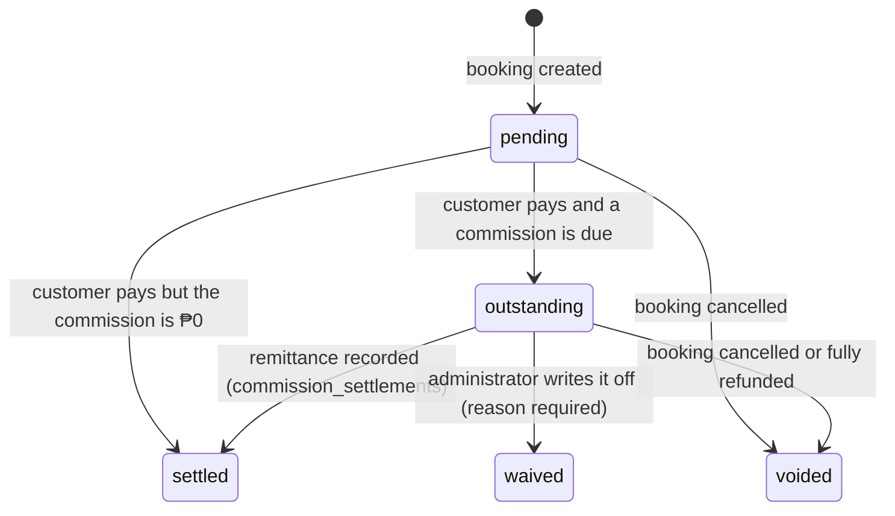

# Commission Tiers and Settlement

SkillServe's commission is **inclusive**: it is contained within the price the provider advertises,
never added on top of it. A ₱200 service at a 10% band means the customer pays **₱200**, SkillServe's
share is **₱20**, and the provider receives **₱180**.

This is why `bookings.total_price` equals `service_price` and `platform_fee` is recorded beside it
rather than added to it — the contract the mobile app already relies on.

## Tiers

`commission_tiers` holds the bands an administrator configures. Both bounds are **inclusive**, and a
NULL `max_amount` is the open-ended top band, so the configuration reads exactly as the business
states it:

| min_amount | max_amount | percentage |
|---|---|---|
| 0 | 199.99 | 5 |
| 200 | 499.99 | 10 |
| 500 | 999.99 | 15 |
| 1000 | *(null)* | 20 |

Two **active** bands may never claim the same peso amount, or the rate charged would depend on row
order. `CommissionTierService` refuses an overlap on every driver; on PostgreSQL an exclusion
constraint (`commission_tiers_no_active_overlap`, `EXCLUDE USING gist` over
`numrange(min_amount, max_amount, '[]')` `WHERE (is_active AND deleted_at IS NULL)`) enforces it in
the database too, which is what closes the race between two administrators saving at once. Disabled
and soft-deleted bands are exempt — they charge nobody.

## Which rate applies

`CommissionCalculator` is the single authority. The client never calculates a commission.

| Situation | Rate | `source` |
|---|---|---|
| An active band covers the amount | that band's percentage | `tier` |
| Bands exist but none covers the amount | **0%**, and the gap is logged | `gap` |
| No active bands at all | `marketplace.commission_rate` (legacy flat setting) | `fallback` |

The `fallback` path is what makes the deploy a no-op until tiers are configured.

## Snapshotting

`CreateClientBookingAction` writes `platform_fee`, `commission_rate` and `commission_tier_id` onto
the booking when it is made. Historical bookings therefore **never move** when an administrator
changes the tiers afterwards.

## Settlement

Because the commission is inclusive, a provider paid in cash for an on-hand job has collected
SkillServe's share along with their own and owes it back. `bookings.commission_status` tracks that.

- Becoming outstanding is driven by **payment**, not completion: `BookingPaymentService::markPaid`
  calls `CommissionLedger::markOutstanding`. A booking carrying no commission settles itself, so no
  provider is blocked over ₱0.
- A **full** refund voids the commission; a partial one leaves it alone. A commission already
  settled is never reopened — reversing that is a refund decision of its own.
- Cancellation voids it, via `VoidCommissionOnCancellation` listening to `BookingCancelled`.
- `commission_settlements` is one row per booking (unique on `booking_id`), recording amount, method
  (`gcash`, `bank_transfer`, `cash`, `offset`, `other`), reference and who recorded it. The amount is
  always taken from the booking, never from the request.

## What an outstanding commission blocks

Enforced by `TransactionEligibility`, the one place the rule lives, so mobile and admin web inherit
identical behaviour from the API.

| Action | Blocked while outstanding? |
|---|---|
| Accept (confirm) a new booking | **Yes** |
| Create or edit a service | **Yes** |
| Start / complete an agreed job | No |
| Decline / cancel | No |
| Anything the **customer** does | No — never |

Work the provider has already agreed to is deliberately never blocked: a customer who is already
booked must not be stranded by a debt between the provider and the platform, and a provider paid up
front would otherwise be unable to begin the very job that put them in debt.

## Endpoints

| Surface | Endpoint | Permission |
|---|---|---|
| Admin | `GET/POST/PUT/PATCH/DELETE /api/commission-tiers` | `view commissions` to read, `manage commissions` to change |
| Admin | `GET /api/commissions` (+ `meta.totals`) | `view commissions` |
| Admin | `PATCH /api/commissions/{booking}/settle` · `/waive` | `settle commissions` |
| Provider | `GET /api/client/v1/provider/commission-preview?amount=` | provider account |
| Provider | `GET /api/client/v1/provider/commissions` | provider account |

Providers also see an `earnings` block on each of their services and `commission_rate` / `net_amount`
on each of their bookings, so the split is visible before they publish a price.

> [!note] Settlement is recorded, not processed
> No payment gateway is called. A remittance is recorded by an administrator once it arrives, exactly
> as booking payments are. See [[ADR-007 Payments Recorded Not Processed]].

Related: [[Payments and Refunds]] · [[Booking Lifecycle]] · [[System Settings Catalog]] ·
[[bookings]] · [[Cancellation and Fees]]
