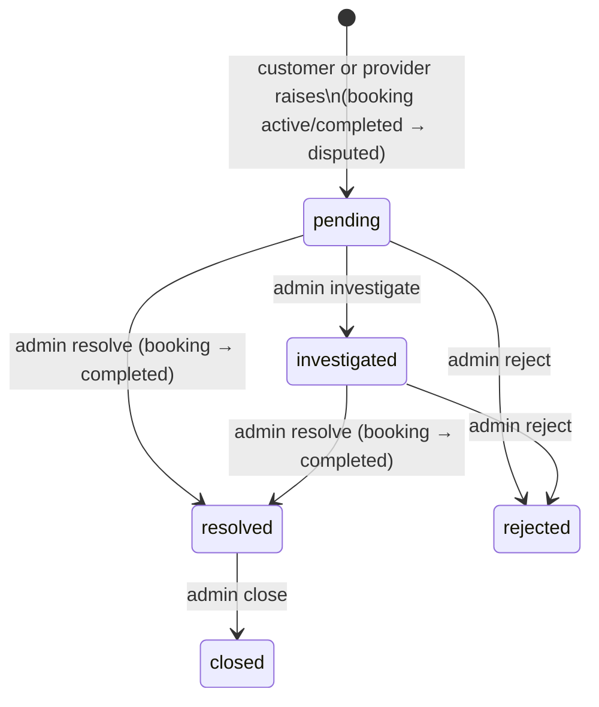

# Disputes Lifecycle

A dispute is **not a separate table**: it is a set of columns on `bookings` — `dispute_reason`,
`disputed_at`, `dispute_status`, `dispute_resolution`, `dispute_evidence` (JSON), `dispute_notes`
(JSON), `dispute_closed_at`, `dispute_closed_by`.

`dispute_status` ∈ `pending, investigated, resolved, rejected, closed`.

## Raising (mobile) — `BookingDisputeService`

- `PATCH /api/client/v1/bookings/{booking}/dispute` with a reason; either participant
  (`EnsureMobileAccount` + `BookingDisputePolicy::raise`).
- Allowed booking status: `active` or `completed`; only once per booking (a second attempt → **409**).
- Sets booking `status = disputed`, `dispute_status = pending`, `disputed_at`.
- **Evidence:** `POST …/dispute/evidence` (image JPG/PNG/WebP ≤5 MB + caption) while
  `dispute_status` is `pending` or `investigated`; max **5** items; stored on the private
  `dispute_evidence` disk and appended to `dispute_evidence` JSON.
- `GET /api/client/v1/disputes` lists the caller's disputes (filter by `dispute_status`).

## Managing (admin) — `DisputeService`

| Action | Endpoint | Effect |
|---|---|---|
| investigate | `PATCH /api/disputes/{booking}/investigate` | `dispute_status = investigated` |
| add note | `PATCH …/notes` | appends `{note, created_at, created_by}` to `dispute_notes` |
| resolve | `PATCH …/resolve` (resolution) | `dispute_status = resolved`, `dispute_resolution`, **booking status → `completed`** |
| reject | `PATCH …/reject` (optional note) | `dispute_status = rejected` |
| close | `PATCH …/close` (optional note) | only from `resolved`; sets `closed`, `dispute_closed_at/by` |
| history | `GET …/history` | activity log entries |
| evidence | `GET …/evidence/{evidence}` | streams a private file |

Open = `pending` or `investigated`; notes/resolve/reject require an open dispute. Also exposed as
`PATCH /api/bookings/{booking}/dispute` with `action ∈ investigate|resolve|reject`
(`ManageDisputeRequest`). Permission: `manage booking disputes` (view: `view bookings`).

Each action fires `BookingDisputeManaged` → audit + `NotifyDisputeParties` (both parties; a resolve
does not also send a duplicate "job completed" — `fromDispute: true`).

> [!warning] Needs Verification — rejected disputes
> Rejecting leaves the booking in `status = disputed` (only `dispute_status` changes), and `close`
> is allowed only from `resolved`. So a rejected dispute's booking stays `disputed` permanently and
> cannot be closed. Confirm this is the intended business outcome.

Related: [[Dispute Management]] · [[Client Disputes]] · [[Booking Lifecycle]]
