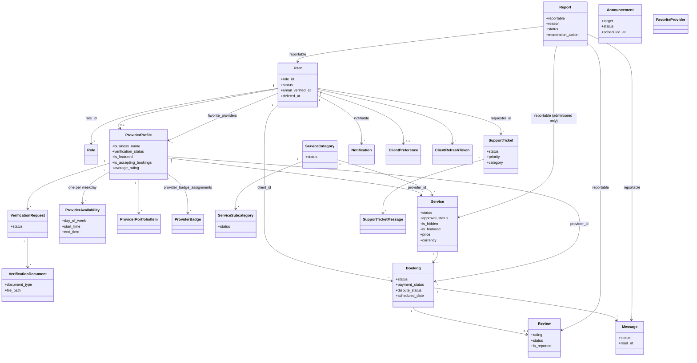

# Domain Model Overview

## Key modelling choices

- **Provider identity is the profile, not the user.** `services.provider_id`, `bookings.provider_id`,
  `reviews.provider_id` reference `provider_profiles.id`.
- **A booking is also the conversation and the dispute.** `messages.booking_id` threads chat;
  dispute fields live on `bookings` ([[Disputes Lifecycle]]).
- **Reports are polymorphic** (`reportable_type/id`). The mobile API files reports against
  `User`, `Review` or `Message` only (`ClientReportService::SUBJECT_TYPES`); `Service` reports exist
  in the admin moderation matrix and in the demo `ReportSeeder`, but the app cannot create them.
- **Soft deletes** on users, service categories/subcategories, services, bookings, reviews, messages,
  reports and support tickets ([[Data Retention and Deletion]]).
- **Aggregates are denormalised:** `provider_profiles.average_rating/total_reviews/total_bookings/
  completed_bookings`, `services.average_rating/total_reviews/total_bookings/completed_bookings`
  (review aggregates recalculated by `RecalculateClientReviewAggregatesAction`).
- **Money:** `decimal(10,2)`; `currency` char(3) default `PHP` since migration
  `2026_09_17_000001` ([[ADR-011 Philippine Peso Currency]]).
- **Audit trail:** `activity_log` (spatie) written by `Log…Activity` listeners.

Table-level detail: [[Database Index]] · [[Entity Relationship Diagram]].
