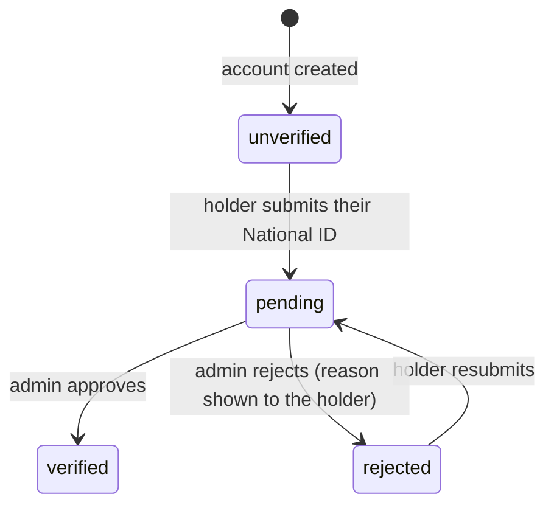

# Identity Verification Lifecycle

Philippine National ID (PhilSys) verification for **customers and providers alike**. It proves who
an account holder is, and gates *transacting*.

> [!important] Not the same thing as provider verification
> [[Provider Verification Lifecycle]] proves a provider is a legitimate tradesperson (documents,
> business details) and gates *publishing services*. Identity verification proves who someone is and
> gates *booking, accepting work and paying*. They are reviewed independently and stored separately,
> which is what lets existing verified providers keep working without being pushed through a new
> queue.



## Storing the card number

The PhilSys Card Number is **never stored in the clear**.

| Column | What it is for |
|---|---|
| `id_number_hash` | HMAC-SHA256 of the normalised 16 digits under a server-side pepper. The only column ever compared, and the only one a unique index can use. |
| `id_number_encrypted` | Laravel `encrypted` cast; lets an administrator settle a disputed match. Cleared on release. |
| `id_number_last4` | The only part ever displayed, in the app or the admin queue. |

The pepper (`config('identity.hash_key')`, env `IDENTITY_HASH_KEY`, defaulting to `APP_KEY`) is what
makes the scheme work: the card-number space is only 10¹⁶, so a plain hash could be enumerated by
anyone holding the database. It must stay stable for the life of the database — see
[[ADR-018 Blind Index for National ID Uniqueness]].

Input is normalised to digits before hashing, so `1234-5678-9012-3456`, `1234 5678 9012 3456` and
the bare digits are one identity. Without that, the same person could hold several accounts simply
by typing their number differently.

## One National ID = one active account

Enforced in the database, not only the application, by a partial unique index:

```sql
CREATE UNIQUE INDEX identity_verifications_active_id_number
ON identity_verifications (id_number_hash)
WHERE id_number_hash IS NOT NULL AND released_at IS NULL
```

Both PostgreSQL and SQLite support partial indexes, so the rule is exercised by the test suite as
well as in production.

**Release happens on permanent deletion only.** A soft-deleted account can be restored for 30 days
([[ADR-016 Soft Delete with 30-Day Purge]]); releasing the ID earlier would let a second account
claim it and leave two live accounts on one ID after that restore. `DataManagementService::forceDelete`
is where the release is triggered.

On release the record **survives** with `user_id` nulled — it is the audit trail for a decision the
platform made about a person — while the encrypted number and the images are dropped. The hash is
kept deliberately: it is pseudonymous, irreversible without the pepper, and is what lets the platform
recognise a previously-removed ID.

## Enforcement

Off by default. Two settings decide whether an account is covered (`IdentityGate`):

| Setting | Effect |
|---|---|
| `identity_verification_required` | Master switch. **False by default**, so deploying changes nothing. |
| `identity_verification_enforced_from` | Grandfathering date. Accounts created before it keep transacting unverified; accounts created on or after it must verify. **Empty means everyone**, which freezes existing users until the queue is cleared. |

What an unverified (but covered) account can and cannot do:

| Action | Allowed unverified? |
|---|---|
| Register, sign in, browse, search, view services and providers | **Yes** |
| Manage own profile / provider profile | **Yes** |
| Create a booking (customer) | No |
| Accept a booking, publish or edit a service (provider) | No |
| Transaction chat | Implicitly gated — messages are booking-scoped, and the booking cannot be created |

`TransactionEligibility` is the single place these rules live, so the Flutter app and the React admin
inherit identical behaviour from the API rather than each implementing it. `GET /api/client/v1/transaction-eligibility`
lets the app *explain* a refusal; it is advisory, and every protected action re-checks server-side.

## Documents and retention

Images (`id_front`, `id_back`, `selfie`; JPG/PNG/PDF ≤10 MB) live on the private `identity` disk with
random UUID filenames, and are never reachable by URL. An administrator opens one through an
authorised, audited download that verifies the document belongs to the submission in the path.

A decision starts the retention clock (`documents_purge_after`); `identity:purge-documents` (daily)
then deletes the images while keeping the decision and its history. Retention is
System Settings → Identity → *Keep National ID images for (days)*, default 90.

## Endpoints

| Surface | Endpoint | Permission |
|---|---|---|
| Holder | `GET/POST /api/client/v1/identity-verification` | active, email-verified mobile account; POST is rate limited (5/hour/user) |
| Holder | `GET /api/client/v1/transaction-eligibility` | same |
| Admin | `GET /api/identity-verifications` · `/{id}` | `view identity verifications` |
| Admin | `PATCH /{id}/approve` | `verify identities` |
| Admin | `PATCH /{id}/reject` (reason required) | `reject identities` |
| Admin | `GET /{id}/documents/{doc}/download` | `view identity verifications` (audited) |

## Deliberate non-features

- **The card number is not searchable.** Hashing a search term would turn the admin queue into a
  "does SkillServe know this ID?" oracle for anyone holding a stolen card.
- **The duplicate-ID refusal does not name the holding account**, for the same reason.
- **No external verification provider is integrated.** There is no public self-service PhilSys API
  for private developers; approval is a human reviewer reading the ID image. `IdentityGate` and the
  review flow are structured so a KYC vendor could later replace the manual decision without the
  enforcement rules changing.

Related: [[Provider Verification Lifecycle]] · [[Commission Tiers and Settlement]] ·
[[Data Retention and Deletion]] · [[identity_verifications]] · [[System Settings Catalog]] ·
[[ADR-018 Blind Index for National ID Uniqueness]]
