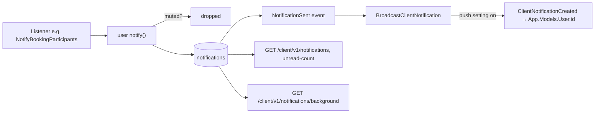

# Notifications Catalog

In-app notifications are Laravel **database notifications** (`notifications` table). Each
`BaseNotification` subclass declares a **category**; if the recipient muted that category in
preferences, the notification is not stored at all (`channelsFor` returns `[]`). Categories
without a value are always delivered.

| Class | Module | Category (mutable?) | Channel | Sent when |
|---|---|---|---|---|
| `BookingStatusNotification` | Bookings | `booking` | database | any booking status change (to the other party) |
| `DisputeUpdateNotification` | Bookings | `booking` | database | dispute investigate/resolve/reject/close (both parties) |
| `BookingMessageNotification` | ClientCommunication | `message` | database | new chat message |
| `SupportTicketResponseNotification` | ClientCommunication | `message` | database | staff responds |
| `SupportTicketResolvedNotification` | ClientCommunication | `message` | database | ticket resolved |
| `ServiceModerationNotification` | Services | `service` | database | admin edits/approves/rejects/hides/features/deletes a service |
| `AnnouncementNotification` | Notifications | `announcement` | database | announcement delivered |
| `ProviderAccountNotification` | Providers | always | database | verification approved/rejected/info requested/removed, provider suspended/activated |
| `AccountStatusNotification` | Users | always | database | user warned/suspended/activated |
| `ReportOutcomeNotification` | ReportsAndModeration | always | database | report resolved/rejected (to reporter) |
| `ReviewModerationNotification` | Reviews | always | database | review hidden/removed/restored |
| `ClientEmailOtpNotification` | ClientAuthentication | — | **mail** | registration OTP |
| `ClientPasswordResetNotification` | ClientAuthentication | — | mail | mobile forgot-password |
| `ClientEmailVerificationNotification` | ClientAuthentication | — | mail | signed verification link |
| `AdminPasswordResetNotification` | Authentication | — | mail | admin forgot-password (link to `FRONTEND_URL/reset-password`) |
| `UserBannedMail`, `UserUnbannedMail` | Users | — | mail (Mailable) | ban / unban (gated by email setting) |

Mobile preference columns (`client_preferences`): `booking_notifications`,
`service_notifications`, `message_notifications`, `announcement_notifications`
(`ClientPreference::NOTIFICATION_CATEGORIES`).

## Delivery path

Global switches (System Settings → Notifications): `email_notifications_enabled`,
`push_notifications_enabled` (realtime + closed-app), `announcement_notifications_enabled`
(blocks sending announcements). See [[System Settings Catalog]].

## Announcements

`announcements.target` ∈ `all, customers, providers, selected` (`recipient_ids` for selected);
`status` ∈ `pending, scheduled, sent, failed`. Created by `POST /api/notifications/announcements`,
delivered by `SendAnnouncementJob` (delayed to `scheduled_at`). A scheduled/pending one can be
deleted. See [[Notifications and Announcements]].

Related: [[Client Notifications]] · [[notifications]] · [[announcements]]
