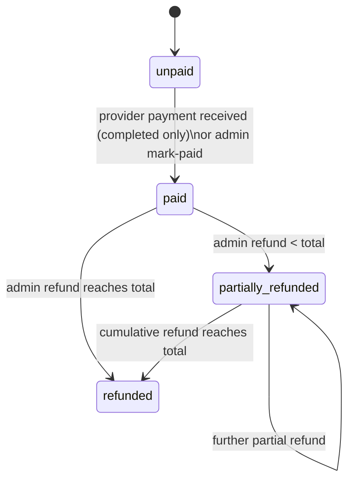

# Payments and Refunds

SkillServe **records** payments; it never processes cards or moves money. Customers pay providers
off-platform (cash, GCash, …). See [[ADR-007 Payments Recorded Not Processed]].

`bookings.payment_status` ∈ `unpaid, paid, partially_refunded, refunded`.

| Action | Who | Endpoint | Allowed booking status | Permission |
|---|---|---|---|---|
| Payment received | provider | `PATCH /api/client/v1/provider/bookings/{id}/payment-received` (optional reference) | `completed` | provider owns booking |
| Mark paid | admin | `PATCH /api/bookings/{id}/mark-paid` | `confirmed, active, completed, disputed` (`PAYABLE_STATUSES`) | `manage booking payments` (or `manage bookings`) |
| Refund | admin | `PATCH /api/bookings/{id}/refund` (amount, reason) | booking must be `paid`/`partially_refunded` | `manage booking payments` |

Rules (`BookingPaymentService`):
- Mark paid requires `payment_status = unpaid` (else **409** "already marked as paid"); sets
  `paid_at`, `payment_recorded_by`, `payment_reference`.
- Refunds accumulate in `refunded_amount`; over-refunding is refused; status becomes `refunded` when
  the total reaches `total_price`, else `partially_refunded`; sets `refunded_at`, `refund_reason`.
- Every change fires `BookingPaymentRecorded` → audit log + `NotifyPaymentParticipants` (the other
  party is notified).

The mobile **Payments** screens (customer) and **Earnings** screen (provider) derive their data from
bookings — there is no payments table or endpoint.

> [!note] The commission is settled separately
> Recording a booking as paid also makes the provider's commission **outstanding**, because the
> commission is included in the price they were paid. See [[Commission Tiers and Settlement]].

Related: [[Commission Tiers and Settlement]] · [[Booking Lifecycle]] · [[Booking Management]] · [[Client Payments View]] ·
[[Provider Earnings and Statistics]]
