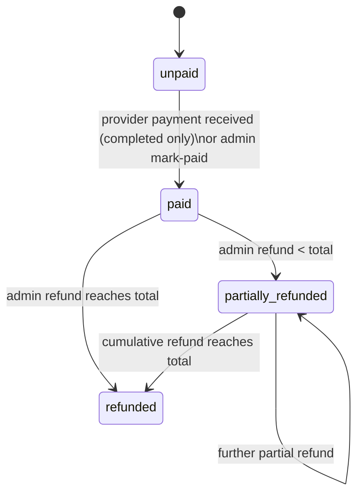

# Payments and Refunds

SkillServe **records** payments; it never processes cards or moves money. Customers pay providers
off-platform (cash, GCash, …). See [[ADR-007 Payments Recorded Not Processed]].

`bookings.payment_status` ∈ `unpaid, paid, partially_refunded, refunded`.

## Payment methods

Exactly two, as `App\Modules\Bookings\Enums\PaymentMethod`:

| Value | Meaning |
|---|---|
| `on_hand` | Paid directly to the provider, in person |
| `gcash` | Paid through GCash — **recorded by hand** until PayMongo is integrated |

`cash` is still accepted on input as a deprecated alias for `on_hand` and is canonicalised on the way
in. `credit_card`, `debit_card`, `bank_transfer` and `paypal` were removed and are now rejected with
422. Bookings created before the change keep their stored value as display-only history.

> [!warning] The mobile app must be updated
> The Flutter build in the field offers all six old methods and **defaults to `cash`**. The alias
> keeps that default working, but a customer who picks Card, Bank transfer or PayPal now receives a
> validation error. The app should be updated to offer only the two methods and to label `on_hand`.

Which gateway handles a method is configuration (`config/payments.php`). `on_hand` is always
manual. `gcash` uses **PayMongo** when `PAYMONGO_SECRET_KEY` is set, and falls back to manual
settlement when it is not — so a deployment without credentials behaves exactly as it did before.

## Online payment (GCash via PayMongo)

`POST /api/client/v1/bookings/{booking}/pay` starts a payment on the customer's own unpaid booking,
once the provider has accepted it, and returns `redirect_url`. Tapping pay again resumes the same
attempt.

PayMongo's flow: create a Payment Intent → create a `gcash` Payment Method → attach → redirect the
customer → `payment.paid` / `payment.failed` webhook.

> [!important] The webhook marks the booking paid, never the return redirect
> The customer's return from the payment page is a browser navigation anyone can forge by visiting
> the URL. `POST /api/webhooks/paymongo` verifies `Paymongo-Signature` against the **raw** body
> before parsing, and is the only thing that records payment.

Because PayMongo settles into SkillServe's account, a GCash commission is **settled on payment**
rather than becoming outstanding — and SkillServe then owes the provider their net, which is not yet
built (KI-28). See [[ADR-020 PayMongo Collects Into the Platform Account]].

| Action | Who | Endpoint | Allowed booking status | Permission |
|---|---|---|---|---|
| Payment received | provider | `PATCH /api/client/v1/provider/bookings/{id}/payment-received` (optional reference) | `completed` | provider owns booking |
| Mark paid | admin | `PATCH /api/bookings/{id}/mark-paid` | `confirmed, active, completed, disputed` (`PAYABLE_STATUSES`) | `manage booking payments` (or `manage bookings`) |
| Refund | admin | `PATCH /api/bookings/{id}/refund` (amount, reason) | booking must be `paid`/`partially_refunded` | `manage booking payments` |

Rules (`BookingPaymentService`):
- Mark paid requires `payment_status = unpaid` (else **409** "already marked as paid"); sets
  `paid_at`, `payment_recorded_by`, `payment_reference`.
- Refunds accumulate in `refunded_amount`; over-refunding is refused; status becomes `refunded` when
  the total reaches `total_price`, else `partially_refunded`; sets `refunded_at`, `refund_reason`.
- Every change fires `BookingPaymentRecorded` → audit log + `NotifyPaymentParticipants` (the other
  party is notified).

The mobile **Payments** screens (customer) and **Earnings** screen (provider) derive their data from
bookings — there is no payments table or endpoint.

> [!note] The commission is settled separately
> Recording a booking as paid also makes the provider's commission **outstanding**, because the
> commission is included in the price they were paid. See [[Commission Tiers and Settlement]].

Related: [[Commission Tiers and Settlement]] · [[Booking Lifecycle]] · [[Booking Management]] · [[Client Payments View]] ·
[[Provider Earnings and Statistics]]
