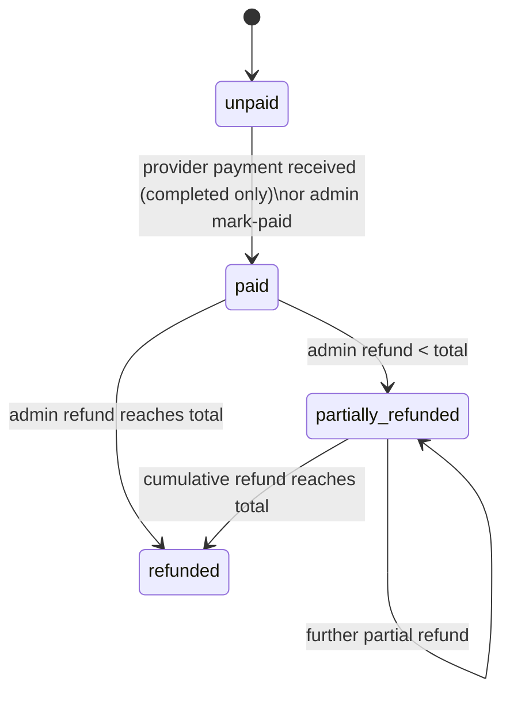

# Payments and Refunds

SkillServe **records** payments; it never processes cards or moves money. Customers pay providers
off-platform (cash, GCash, …). See [[ADR-007 Payments Recorded Not Processed]].

`bookings.payment_status` ∈ `unpaid, paid, partially_refunded, refunded`.

## Payment methods

Exactly two, as `App\Modules\Bookings\Enums\PaymentMethod`:

| Value | Meaning |
|---|---|
| `on_hand` | Paid directly to the provider, in person |
| `gcash` | Paid through GCash, to the **provider's own number** — recorded by hand |

`cash` is still accepted on input as a deprecated alias for `on_hand` and is canonicalised on the way
in. `credit_card`, `debit_card`, `bank_transfer` and `paypal` were removed and are now rejected with
422. Bookings created before the change keep their stored value as display-only history.

The mobile app was brought into line on 2026-09-26: the booking form offers `on_hand` and `gcash`
only, and a booking made by an older build still displays whatever method it was stored with.

Which gateway handles a method is configuration (`config/payments.php`), and **both are mapped to
the manual gateway unconditionally** — configuring `PAYMONGO_SECRET_KEY` does not change that. See
below.

## How money actually moves

**SkillServe is never in the payment path.** The customer pays the provider directly — GCash to the
provider's own number, or cash on the job — and the provider then owes SkillServe its commission,
which they must remit to keep taking work. See
[[ADR-021 Direct Payment with Provider-Remitted Commission]].

Both payment methods therefore route to the **manual** gateway unconditionally, even when PayMongo
credentials are configured. A GCash booking is settled exactly like a cash one, and its commission
becomes `outstanding` the same way.

The customer sees the provider's GCash details as `payment_instructions` on their own booking —
number, account name, amount and the booking number to use as a reference. They appear only while
the booking is an unpaid GCash job, and never in the public catalog: they are the provider's
personal payment details.

`gcash_name` is shown alongside the number so the customer can check it against the recipient name
GCash displays before confirming — that is what catches a mistyped number.

> [!warning] No escrow, no payment guarantee
> Because the platform never holds the money, it cannot reverse a payment. A customer who pays and
> receives nothing, or a provider who works unpaid, is a dispute — not something SkillServe can
> undo. That is the trade accepted for not handling other people's money.

## PayMongo (built, not used for bookings)

> [!warning] No booking is payable online, and the app has no "Pay now" button
> `POST /api/client/v1/bookings/{booking}/pay` resolves the booking's method to its gateway, finds
> the manual one, and refuses with a **422** — for every booking, with or without credentials. No
> payment intent is ever created. The endpoint is kept because the mapping is configuration rather
> than code; the one defensible future use is a provider paying their **own** outstanding
> commission, which is SkillServe collecting its own revenue and is not built.

Were a method ever routed to a collecting gateway, the endpoint would start a payment on the
customer's own unpaid booking once the provider had accepted it, return `redirect_url`, and resume
the same attempt when tapped again.

PayMongo's flow: create a Payment Intent → create a `gcash` Payment Method → attach → redirect the
customer → `payment.paid` / `payment.failed` webhook.

> [!important] The webhook marks the booking paid, never the return redirect
> The customer's return from the payment page is a browser navigation anyone can forge by visiting
> the URL. `POST /api/webhooks/paymongo` verifies `Paymongo-Signature` against the **raw** body
> before parsing, and is the only thing that records payment.

Were PayMongo ever used for a booking it would settle into SkillServe's account, so the GCash
commission would be **settled on payment** rather than becoming outstanding — and SkillServe would
then owe the provider their net, with no mechanism to pay it. That is exactly why the mapping is
fixed to manual. See [[ADR-020 PayMongo Collects Into the Platform Account]] and
[[ADR-021 Direct Payment with Provider-Remitted Commission]].

```mermaid
stateDiagram-v2
  [*] --> unpaid
  unpaid --> paid : provider payment received (completed only)\nor admin mark-paid
  paid --> partially_refunded : admin refund < total
  paid --> refunded : admin refund reaches total
  partially_refunded --> partially_refunded : further partial refund
  partially_refunded --> refunded : cumulative refund reaches total
```

| Action | Who | Endpoint | Allowed booking status | Permission |
|---|---|---|---|---|
| Payment received | provider | `PATCH /api/client/v1/provider/bookings/{id}/payment-received` (optional reference) | `completed` | provider owns booking |
| Mark paid | admin | `PATCH /api/bookings/{id}/mark-paid` | `confirmed, active, completed, disputed` (`PAYABLE_STATUSES`) | `manage booking payments` (or `manage bookings`) |
| Refund | admin | `PATCH /api/bookings/{id}/refund` (amount, reason) | booking must be `paid`/`partially_refunded` | `manage booking payments` |

Rules (`BookingPaymentService`):
- Mark paid requires `payment_status = unpaid` (else **409** "already marked as paid"); sets
  `paid_at`, `payment_recorded_by`, `payment_reference`.
- Refunds accumulate in `refunded_amount`; over-refunding is refused; status becomes `refunded` when
  the total reaches `total_price`, else `partially_refunded`; sets `refunded_at`, `refund_reason`.
- Every change fires `BookingPaymentRecorded` → audit log + `NotifyPaymentParticipants` (the other
  party is notified).

The mobile **Payments** screens (customer) and **Earnings** screen (provider) derive their data from
bookings — there is no payments table or endpoint.

> [!note] The commission is settled separately
> Recording a booking as paid also makes the provider's commission **outstanding**, because the
> commission is included in the price they were paid. See [[Commission Tiers and Settlement]].

Related: [[Commission Tiers and Settlement]] · [[Booking Lifecycle]] · [[Booking Management]] · [[Client Payments View]] ·
[[Provider Earnings and Statistics]]
