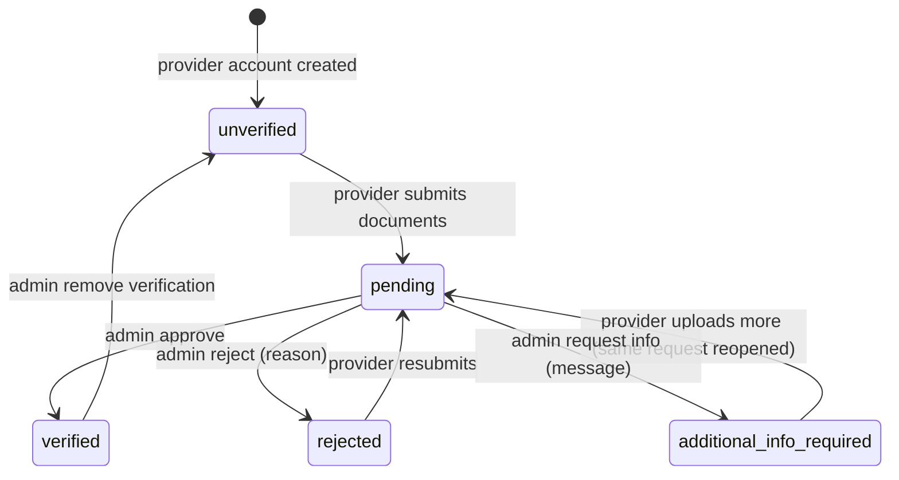

# Provider Verification Lifecycle

> [!note] Distinct from National ID verification
> This proves a provider is a legitimate tradesperson and gates *publishing services*.
> [[Identity Verification Lifecycle]] proves who an account holder is and gates *transacting*.
> The two are stored and reviewed separately.

Two status fields move together:
- `provider_profiles.verification_status` ∈ `unverified, pending, verified, rejected, additional_info_required`
- `verification_requests.status` ∈ `pending, approved, rejected, additional_info_required`

## Provider side (mobile)

- `GET /api/client/v1/provider/verification` — current status, reviewer reason/request, documents.
- `POST /api/client/v1/provider/verification` — multipart: 1–5 `documents[]` each with `type`
  (`government_id`, `certificate`, `other`) and `file` (JPG/PNG/PDF ≤10 MB), optional `notes`
  (≤1000). Allowed when status ∈ `unverified, rejected, additional_info_required`
  (`SUBMITTABLE`); otherwise 422.
- An `additional_info_required` request is **reopened** (back to `pending`); otherwise a **new**
  request is created. Profile → `pending`, `rejection_reason` cleared. Fires
  `ProviderVerificationSubmitted` (audit log).
- Files go to the private `verification` disk.

## Admin side

| Action | Endpoint | Precondition | Result | Permission |
|---|---|---|---|---|
| Approve | `PATCH /api/providers/{p}/verification/approve` | request pending | request `approved`, profile `verified`, `verified_at/by` | `verify providers` |
| Reject | `…/verification/reject` (reason) | request pending | request + profile `rejected`, reason stored | `reject providers` |
| Request info | `…/verification/request-info` (message) | request pending | request + profile `additional_info_required` | `verify providers` |
| Remove verification | `…/verification/remove` | profile verified | profile `unverified` | `verify providers` |
| Suspend / Activate | `PATCH /api/providers/{p}/suspend` · `/activate` | not suspended / suspended | `provider_profiles.suspended_at/by/suspension_reason` | `suspend providers` / `activate providers` |
| Download document | `GET …/verification-documents/{doc}/download` | — | streams file | `view providers` |
| History | `GET …/verification-history` | — | past requests | `view providers` |

Every decision fires an event → `LogProviderActivity` + `NotifyProviderOfAccountDecision`
(in-app/realtime/closed-app notification to the provider).

## Why it matters

- Only **verified** providers can create or edit services (`ProviderServiceService::verifiedProfile`
  → 403 otherwise).
- The public catalog only lists providers with `verification_status = verified`,
  `suspended_at IS NULL` and an active user ([[Marketplace Visibility Rules]]).

Related: [[Service Provider Management]] · [[Provider Account and Verification]] ·
[[verification_requests]] · [[verification_documents]] · [[provider_profiles]]
