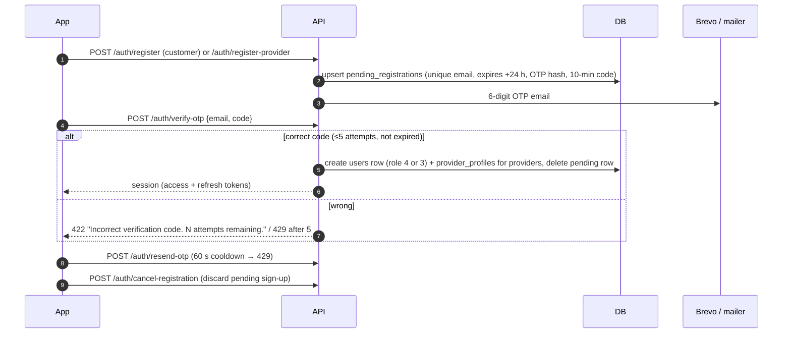

# Registration and OTP Flow

Mobile sign-up creates **no user** until the email is verified.

| Rule | Value | Source |
|---|---|---|
| OTP length | 6 digits (`random_int`) | `ClientEmailOtpService` |
| OTP lifetime | 10 min (`CODE_TTL_MINUTES`) | same |
| Max wrong attempts | 5 (`MAX_ATTEMPTS`) → 429 | same |
| Resend cooldown | 60 s → 429 | same |
| Pending registration lifetime | 24 h (`PendingRegistration::LIFETIME_HOURS`), pruned on next attempt | model |
| Provider sign-up switch | `marketplace.provider_registration_enabled` | `ProviderSignups` |
| Rate limit | `client-auth` limiter: 20/min per IP + 10/min per email | `AppServiceProvider` |
| Provider extra fields | business_name, specialization, experience_years, bio (copied to `provider_profiles`) | `pending_registrations` columns |

## Google sign-in

- `POST /auth/google {id_token}`: the backend verifies the ID token with Google's **tokeninfo**
  endpoint (10 s timeout) and checks `aud` = `GOOGLE_CLIENT_ID`. A linked (`users.google_sub`) or
  matching-email account signs in (no OTP).
- Unknown Google user → returns a registration draft; the app completes it with
  `POST /auth/google/register {role: customer|provider, …}`.
- Both share the `login` throttle.

## Email verification (legacy path)

`GET /auth/verify-email/{user}/{hash}` (signed URL) and `POST /auth/verification-notification`
also exist. The mobile app uses OTP; it does not call these.

> [!warning] Needs Verification
> Whether any client still relies on the signed-link verification routes is unconfirmed; the Flutter
> app references neither.

## Login rules (mobile)

`POST /auth/login`: account must be a mobile account; suspended/banned → **403** with
`meta.account` ([[Account Status Lifecycle]]); unverified email → held at verification. Returns a
60-minute access token + rotating refresh token ([[Token and Session Management]]).

Related: [[Client Authentication and Account]] · [[Provider Onboarding and Registration]] ·
[[pending_registrations]]
