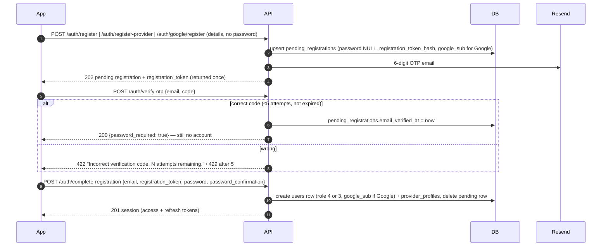

# Registration and OTP Flow

Mobile sign-up creates **no user** until the email is verified **and** a password is chosen. Email
and Google sign-ups take the same steps, in this order:

**National ID scan → details (+ email, or the Google account) → 6-digit code → password + confirmation → account**

> [!info] Who sends the code (2026-10-07)
> Production: `OTP_DRIVER=mail` with `MAIL_MAILER=resend-api` — SkillServe generates the code,
> stores its hash, and `ClientEmailOtpNotification` goes out **through Resend** from a domain
> verified in Resend (free plan: 3,000/month, 100/day). Brevo suspended the account and Mailjet
> blocked its new one; Twilio has no free trial in the Philippines. The Gmail API
> (`gmail-api`, no domain needed) stays as the alternative. The 10-minute
> expiry, 5 attempts and 60-second resend window are enforced here. `GET /api/health` →
> `services.otp` shows whether sending is configured. Setup: DEPLOYMENT.md → "Email codes".
> Also built: `OTP_DRIVER=twilio` (Twilio Verify generates, emails and checks the code; the row
> stores the marker `twilio-verify`), unused because it is paid.

```mermaid
sequenceDiagram
  autonumber
  participant App
  participant API
  participant DB
  participant Mail as Resend
  App->>API: POST /auth/register | /auth/register-provider | /auth/google/register (details, no password)
  API->>DB: upsert pending_registrations (password NULL, registration_token_hash, google_sub for Google)
  API->>Mail: 6-digit OTP email
  API-->>App: 202 pending registration + registration_token (returned once)
  App->>API: POST /auth/verify-otp {email, code}
  alt correct code (≤5 attempts, not expired)
    API->>DB: pending_registrations.email_verified_at = now
    API-->>App: 200 {password_required: true} — still no account
  else wrong
    API-->>App: 422 "Incorrect verification code. N attempts remaining." / 429 after 5
  end
  App->>API: POST /auth/complete-registration {email, registration_token, password, password_confirmation}
  API->>DB: create users row (role 4 or 3, google_sub if Google) + provider_profiles, delete pending row
  API-->>App: 201 session (access + refresh tokens)
```

| Rule | Value | Source |
|---|---|---|
| OTP length | 6 digits (`random_int`) | `ClientEmailOtpService` |
| OTP lifetime | 10 min (`CODE_TTL_MINUTES`) | same |
| Max wrong attempts | 5 (`MAX_ATTEMPTS`) → 429 | same |
| Resend cooldown | 60 s → 429 (`resend-otp`; a repeat sign-up in that window answers 429 with `meta.verification_required`) | same |
| Password | min 8, confirmed; chosen **after** the code | `CompleteClientRegistrationRequest` |
| Registration token | 64 random chars, stored as SHA-256; required to set the password and to cancel, so knowing the email is not enough | `PendingRegistrationService` |
| Pending registration lifetime | 24 h (`PendingRegistration::LIFETIME_HOURS`), pruned on next attempt | model |
| Provider sign-up switch | `marketplace.provider_registration_enabled` | `ProviderSignups` |
| Rate limit | `client-auth` limiter: 20/min per IP + 10/min per email | `AppServiceProvider` |
| Provider extra fields | business_name, specialization, experience_years, bio (copied to `provider_profiles`) | `pending_registrations` columns |

**Older app versions** still send `password` to `/auth/register`; such a row completes on the code
alone (`/auth/verify-otp` returns the session, the pre-2026-10-03 behaviour). Cancelling such a row
uses the password instead of the token.

## Google sign-in

Google identifies the person; **the account password signs in**. Google alone never does.

- `POST /auth/google {id_token}`: the backend verifies the ID token with Google's **tokeninfo**
  endpoint (10 s timeout) and checks `aud` = `GOOGLE_CLIENT_ID`.
  - Linked (`users.google_sub`) or matching-email account → `{password_required: true, email}`;
    the app asks for the password and calls again with `{id_token, password}`. Right password →
    session (and the Google account is linked); wrong → 401 "Incorrect password."
  - Unknown Google user → a registration draft; the app collects the details and calls
    `POST /auth/google/register`, which starts the code + password steps above (the code goes to
    the Google address). An existing account there → 409, log in instead.
- Accounts created by Google sign-up **before 2026-10-03** have a random password nobody knows;
  their owners set one with Forgot password (the mobile password prompt links to it).
- Both share the `login` throttle.

## Forgot password (mobile)

**Email → 6-digit code → new password + confirmation.** All three steps happen in the app.

| Step | Endpoint | Notes |
|---|---|---|
| 1 | `POST /auth/forgot-password {email}` | Emails a code (`ClientEmailOtpNotification`, purpose `password_reset`). Always 202: unknown, inactive or admin addresses, and an address sent a code in the last 60 s, get no email but the same answer. |
| 2 | `POST /auth/verify-reset-code {email, code}` | Same OTP rules (10 min, 5 attempts). Returns a single-use `reset_token` from the `clients` password broker (60 min). |
| 3 | `POST /auth/reset-password {email, token, password, password_confirmation}` | Sets the password and revokes every session. |

The old emailed reset **link** (`ClientPasswordResetNotification`, `CLIENT_PASSWORD_RESET_URL`)
was removed: it pointed to a page that never existed.

## Email verification (legacy path)

`GET /auth/verify-email/{user}/{hash}` (signed URL) and `POST /auth/verification-notification`
also exist. The mobile app uses OTP; it does not call these.

> [!warning] Needs Verification
> Whether any client still relies on the signed-link verification routes is unconfirmed; the Flutter
> app references neither.

## Login rules (mobile)

`POST /auth/login`: account must be a mobile account; suspended/banned → **403** with
`meta.account` ([[Account Status Lifecycle]]); unverified email → held at verification. Returns a
60-minute access token + rotating refresh token ([[Token and Session Management]]).

Related: [[Client Authentication and Account]] · [[Provider Onboarding and Registration]] ·
[[pending_registrations]]
