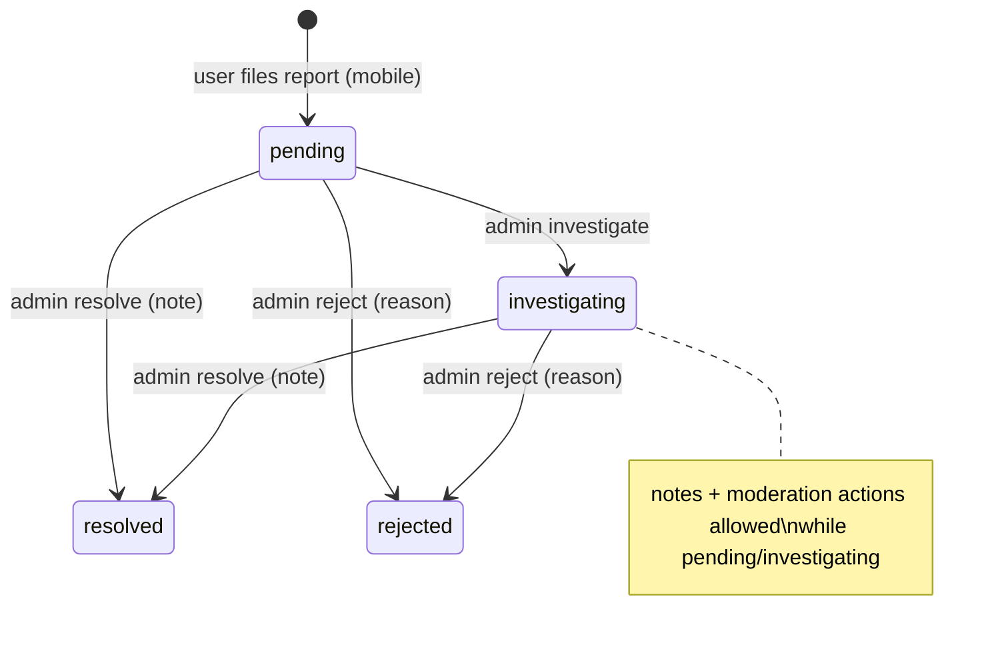

# Reports and Moderation Lifecycle

`reports.status` ∈ `pending, investigating, resolved, rejected`.

## Filing (mobile) — `POST /api/client/v1/reports`

Exactly one subject: `booking_id` (→ reports the **other party** of that booking, a `User`),
`review_id` (a published review) or `message_id` (a message the caller received). `reason` must be in
`Report::REASONS`: `service_quality, no_show, safety_concern, payment_dispute,
misleading_information, harassment, inappropriate_content, spam, other`. `description` 10–2000 chars.

- Reporting a review sets `reviews.is_reported = true` (appears under Admin → Reviews → Reported).
- **One open report per reporter per subject** — partial unique index
  `reports_one_open_per_subject (reporter_id, reportable_type, reportable_id) WHERE status IN
  ('pending','investigating') AND deleted_at IS NULL` (PostgreSQL-only SQL).
- Reporter sees status and outcome (`GET /reports`, `GET /reports/{id}`), never investigation notes.
- Legacy reasons still filterable in admin: `fraud, misleading, offensive` (`LEGACY_REASONS`).
  `GET /api/reports/reasons` returns the filterable list.

## Admin actions

| Action | Endpoint | Allowed when | Permission |
|---|---|---|---|
| Investigate | `PATCH /api/reports/{r}/investigate` | not resolved/rejected | `investigate reports` |
| Add note | `PATCH …/notes` | not resolved/rejected; appended to `investigation_notes` JSON | `investigate reports` |
| Resolve | `PATCH …/resolve` (note) | not resolved/rejected | `resolve reports` |
| Reject | `PATCH …/reject` (reason) | not resolved/rejected | `resolve reports` |
| Moderation action | `PATCH …/action` | not resolved/rejected | `manage moderation` |

All also pass with `manage reports`. Resolve/reject notify the **reporter** (`NotifyReporterOfOutcome`).

## Moderation action matrix (`TakeModerationAction::assertApplicable`)

| Reported subject | Allowed actions | Effect |
|---|---|---|
| `User` | `warning`, `suspend`, `ban` (`duration` days/forever, `days`) | warning → `UserWarned` notification; suspend/ban reuse Users module actions |
| `Service` | `hide` | `HideServiceAction` (`is_hidden = true`) |
| `Review` | `hide`, `remove` | `HideReviewAction` / `RemoveReviewAction` |
| `Message` | `remove` | `messages.status = removed`, `removed_by/at` |

The action is recorded on the report (`moderation_action`, `action_taken_by/at`, `action_note`).

> [!info] Service reports
> The admin queue supports `Service` reports (A 9.2), but the mobile API cannot file them
> (`ClientReportService::SUBJECT_TYPES = [User, Review, Message]`); only the demo `ReportSeeder`
> creates them. See [[Known Issues and Gaps]].

Related: [[Reports and Moderation]] · [[Client Reports]] · [[reports]] · [[Account Status Lifecycle]]
