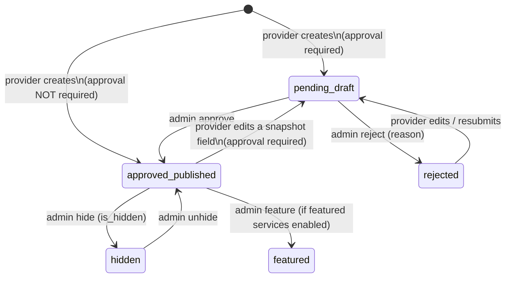

# Service Approval Lifecycle

A service has two axes:
- `status` ∈ `draft, published, archived` (publication)
- `approval_status` ∈ `pending, approved, rejected` (moderation)
- plus flags `is_hidden`, `is_featured`, and soft delete.

## Provider side (`ProviderServiceService`)

- Provider must be **verified** (else 403 "must be verified before you can add or edit services").
- New service: if `marketplace.service_approval_required` → `approval_status pending, status draft`;
  otherwise `approved, published, approved_at = now`.
- Editing any **snapshot field** (`title, description, category_id, subcategory_id, price,
  price_type, duration, location, status, approval_status, is_featured, is_hidden`) sends an approved
  service back to review when approval is required.
- `price_type` ∈ `fixed, hourly, custom`. Delete = soft delete via the Services module's
  `DeleteServiceAction`.
- Endpoints: `GET/POST /api/client/v1/provider/services`, `GET/PUT/PATCH/DELETE …/{service}`.

## Admin side (Services module)

| Action | Endpoint | Permission |
|---|---|---|
| list/search/filter | `GET /api/services` (`search`, `category_id`, `status`, `approval_status`, …) | `view services` |
| view | `GET /api/services/{id}` | `view services` |
| edit | `PUT/PATCH /api/services/{id}` | `edit services` |
| approve | `PATCH …/approve` | `approve services` |
| reject | `PATCH …/reject` (reason) | `reject services` |
| hide/unhide | `PATCH …/hide` | `edit services` |
| feature/unfeature | `PATCH …/feature` — refused when `marketplace.featured_services_enabled` is off | `feature services` |
| delete | `DELETE …/{id}` (soft) | `delete services` |

There is **no admin create endpoint** — services come from providers ("moderation-only service
management", frontend commit 2026-09-17). `CreateServiceAction` exists and is used by the provider
flow.

Every admin action notifies the provider (`NotifyProviderOfServiceModeration`, listing changed
fields on edit) and is audit-logged (`LogServiceActivity`). A service can also be hidden by a
moderation action on a service report.

Related: [[Service Management]] · [[Provider Service Management]] · [[services]] ·
[[Marketplace Visibility Rules]]
