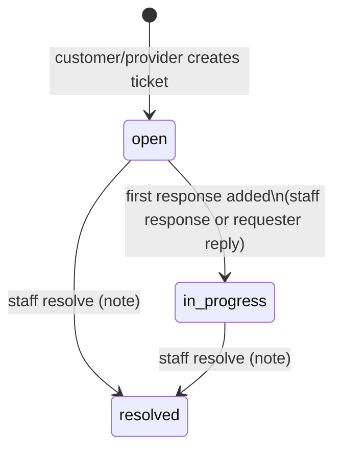

# Support Ticket Lifecycle

`support_tickets.status` ∈ `open, in_progress, resolved`; `priority` ∈ `low, normal, high, urgent`
(default `normal`); `category` free text ≤40 chars (default `general`).

| Step | Who | Endpoint | Notes |
|---|---|---|---|
| Create | customer or provider | `POST /api/client/v1/support/tickets` `{subject ≤160, description ≤10000, category?}` | `ticket_number = "SUP-" + 12 random uppercase chars`; `EnsureMobileAccount` |
| Reply | requester | `POST …/tickets/{t}/replies` | resolved tickets refuse replies (422); a reply on an `open` ticket also moves it to `in_progress` (shared `AddSupportTicketResponseAction`) |
| List/view | requester | `GET …/tickets`, `GET …/tickets/{t}` | own tickets only |
| List/search/filter | staff | `GET /api/support/tickets` (`search, status, priority, category, assigned_to, sort`) | `view support` |
| Assign | staff | `PATCH /api/support/tickets/{t}/assign` (`GET …/assignees` lists staff) | `assign support tickets`; assignee must be an **active administrator** |
| Respond | staff | `POST …/{t}/responses` | moves `open → in_progress`; refused once resolved; notifies requester |
| Resolve | staff | `PATCH …/{t}/resolve` (note) | refused if already resolved; notifies requester |

Messages live in `support_ticket_messages`. Staff actions are audit-logged
(`LogSupportTicketActivity`).

> [!info] "Assigned" status
> The mobile requirement M 12.5 mentions an *assigned* state; the implementation has no such status —
> assignment sets `assigned_to/by/at` while status stays `open`/`in_progress`.

Related: [[Support Management]] · [[Client Support]] · [[support_tickets]]
