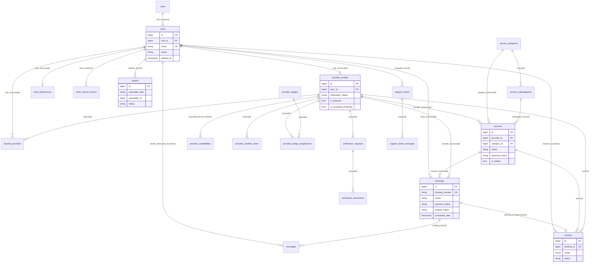

# Entity Relationship Diagram

Core business tables (framework, cache, queue and RBAC pivots omitted). FK delete behaviour in
brackets.

Polymorphic links (not drawn): `reports.reportable` → users / reviews / messages / services;
`notifications.notifiable` → users; `activity_log.subject` and `.causer`; `personal_access_tokens.tokenable` → users;
`media.model`.

Related: [[Domain Model Overview]] · [[Database Index]]
