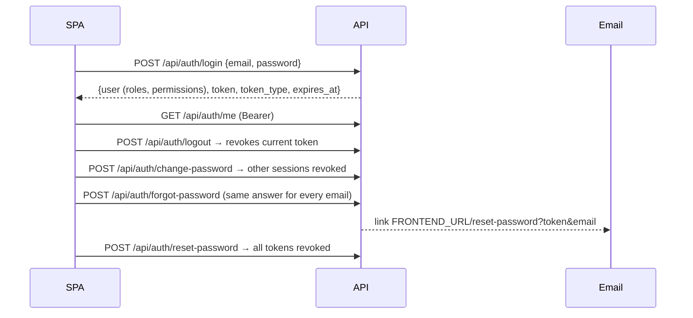
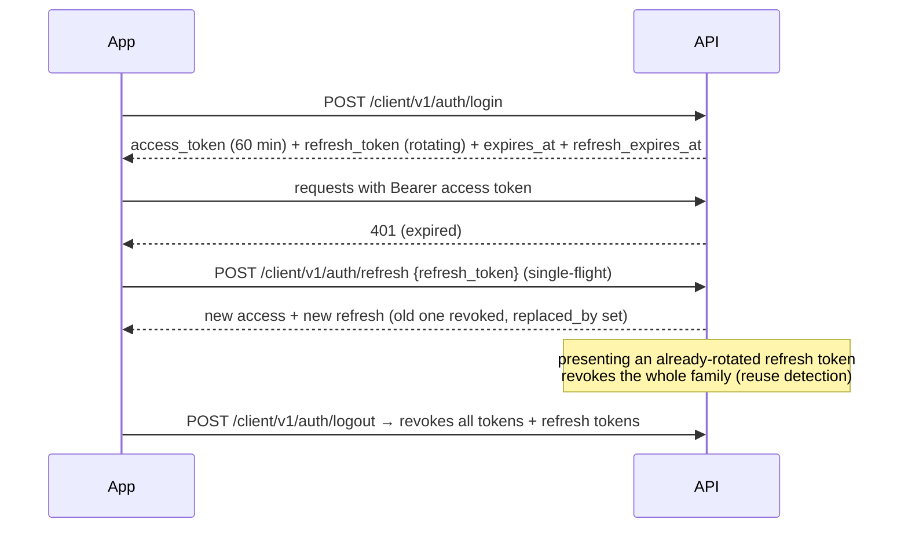

# Authentication Flows

Three kinds of Sanctum tokens, all in `personal_access_tokens`.

| Token name | Issued by | Abilities | Lifetime | Stored by client |
|---|---|---|---|---|
| `admin-session` | `POST /api/auth/login` | `*` | `system.session_timeout_minutes` (default 1440) — both `expires_at` and a created-at check | Admin web `localStorage['skillserve:token']` |
| `client-access` | mobile login / OTP verify / Google / refresh | `client:auth` | `CLIENT_ACCESS_TOKEN_EXPIRATION` = 60 min | Mobile secure storage |
| `client-background` | `POST /client/v1/notifications/background-token` | `client:notifications` | `CLIENT_BACKGROUND_TOKEN_EXPIRATION` = 525600 min **but see KI-01** | Mobile secure storage |

Plus the mobile **refresh token** (opaque, SHA-256 stored in `client_refresh_tokens`), window
`CLIENT_REFRESH_TOKEN_EXPIRATION` = 525600 min counted from last use.

## Admin web

- Login refuses: bad credentials (401), inactive account (403), accounts **without any staff role**
  (401 — mobile users can't enter). Expired temporary bans are lifted during login.
- Events → activity log: `AdministratorLoggedIn/LoggedOut/LoginFailed`, `PasswordChanged`
  (IP and user agent recorded). The plain token is on the event object but is **not** logged.
- `/auth/me|logout|change-password` require ability `admin:auth` via `CheckAbilities`; the admin
  token has `*`, so it passes, while mobile tokens (`client:auth`) are refused.
- Other admin routes only require `auth:sanctum` + permission checks; mobile tokens fail those
  because mobile accounts hold no permissions.

## Mobile

- `ClientSessionService::issue()` creates the access token and a refresh token in a family;
  `rotate()` locks the row, refuses revoked/expired tokens, revokes the family on reuse, and issues
  a new pair; `revokeAll()` on logout, password change, suspension, deletion.
- Restricted accounts get 403 + `meta.account` at login, refresh and every protected route.
- Change password: `POST /client/v1/auth/change-password`. Forgot password:
  `POST /client/v1/auth/forgot-password` (see KI-02 — the emailed link targets a page that does
  not exist).

## Background token

The app requests it after sign-in and gives it to its WorkManager task, which may only call
`GET /client/v1/notifications/background` (`EnsureBackgroundNotificationToken`). It is refused by
every other route, by the chat policy and by the user's private broadcast channel; it ends on logout
or password change.

> [!bug] KI-01 — background token killed by the admin session timeout
> `Sanctum::authenticateAccessTokensUsing` rejects any token not named `client-access` once it is
> older than `system.session_timeout_minutes` (default 1440, docs suggest 480). The background token
> is named `client-background`, so it stops working after that period even though it was issued for
> a year. The app only requests a new one when none is stored, and on a 401 it cancels the task
> without clearing the token — so closed-app notifications stop until the user signs out and in.
> Derived from code reading (not reproduced). See [[Known Issues and Gaps]].

Related: [[Token and Session Management]] · [[Admin Authentication]] ·
[[Client Authentication and Account]]
