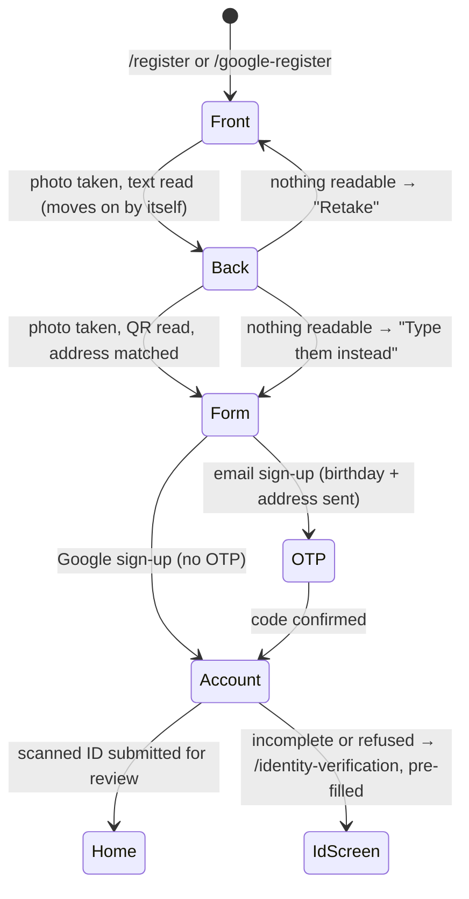

# Mobile Sign-up with National ID Scan

Owner requirement (2026-10-01): sign-up starts by photographing the **Philippine National ID**,
like a SIM registration — front first, then the app moves on to the back by itself — and the
registration fields fill themselves in from it. Required for every account type, by email or by
Google; the plastic **PhilSys card** and the printed **ePhilID** are both read.

## Flow

| Step | What happens | Where |
|---|---|---|
| Front | Camera only. Google ML Kit reads the printed text **on the phone** — the image is not sent anywhere to be read | `NationalIdScanFlow`, `MlKitNationalIdReader` |
| Back | Camera again, without being asked. ML Kit reads the QR code | same |
| Read | `NationalIdParser.parseFront` finds each field by its bilingual label ("Apelyido/Last Name", "Mga Pangalan/Given Names", "Gitnang Apelyido/Middle Name", "Petsa ng Kapanganakan/Date of Birth", "Tirahan/Address") and the 16-digit card number anywhere; `parseQr` reads the QR's JSON leniently (`subject.lName`, `last_name`…). The QR, being machine-written, **overrides** what the camera read; the address only comes from the front | `national_id_parser.dart` |
| Address | The printed address goes to `GET /locations/match`, which pre-selects Region → Province → City → Barangay; anything undecided is left for the user | [[Philippine Addresses]] |
| Form | Given name(s), middle name, last name, PhilSys card number, birthday and the address picker, under "Filled in from your National ID. Check every field". **Scan again** restarts | `SignUpIdentityFields` |
| Submit | `birthday` and `address_details` go with the sign-up; the confirmed card is kept in memory in `IdentityController.scanned` | `AuthController.register` / `completeGoogleRegistration` |
| After | Once the account exists the two photos, card number, full name and birthday are submitted to `POST /identity-verification` automatically, then the user lands home (provider: `/provider-onboarding`). If the scan was incomplete or the API refused it, `/identity-verification` opens **pre-filled** | `submitScannedIdAndRoute` |

### Reading rules worth knowing

- "Gitnang Apelyido" (middle name) contains the last-name word and "Lugar ng Kapanganakan" (place of
  birth) the birth-date word, so the more specific label is matched first.
- Camera misreads in the card number are corrected (O→0, I/l→1); dates accept `JANUARY 01, 1990`,
  `25 DEC 1990`, `1990-01-31` and month-first `01/31/1990`, and refuse impossible or future dates.
- Names are printed in capitals and shown in title case ("DELA CRUZ" → "Dela Cruz").
- Nothing read is trusted blindly: every field is editable, and the photos still go to an
  administrator, who decides.

## Privacy

The card number, name and birthdate live only in memory until submitted, then are dropped; signing
out clears them and the photos. Nothing is written to device storage.

## Build notes

- Packages: `google_mlkit_text_recognition` 0.17.1, `google_mlkit_barcode_scanning` 0.16.1
  (Android 5.0+, already the app's minimum). The app grows by roughly 10–15 MB.
- `android/app/proguard-rules.pro` tells R8 not to fail on the Chinese/Devanagari/Japanese/Korean
  recognisers, which are not bundled.
- **Not yet verified:** a release build on Windows and a scan of a real card — see
  `PENDING_FIXES.md` → **F1**.

## Tests

`national_id_test` (13: a PhilSys front, an ePhilID with a misread digit, QR JSON in two shapes,
dates, the address model), `national_id_scan_flow_test` (2: front → back → details with a fake
camera and reader; the unreadable-card choice), `sign_up_id_submission_test` (5: what is sent after
sign-up, routing, incomplete and refused scans, sign-out), plus the updated
`google_registration_screen_test` and `auth_form_locking_test`.

Related: [[Mobile Identity Verification]] · [[Client Authentication and Account]] ·
[[Philippine Addresses]] · [[Identity Verification Lifecycle]] · [[Client Mobile Features Index]]
