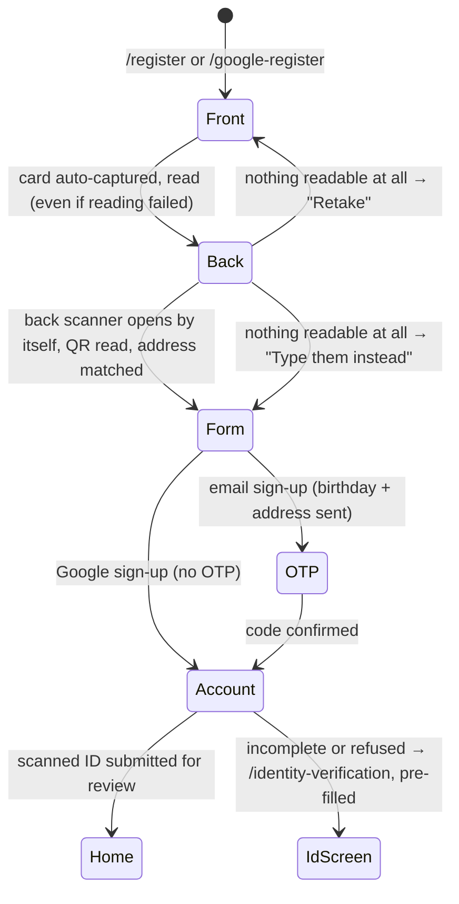

# Mobile Sign-up with National ID Scan

Owner requirement (2026-10-01): sign-up starts by photographing the **Philippine National ID**,
like a SIM registration — front first, then the app moves on to the back by itself — and the
registration fields fill themselves in from it. Required for every account type, by email or by
Google; the plastic **PhilSys card** and the printed **ePhilID** are both read.

## Flow

| Step | What happens | Where |
|---|---|---|
| Front | **ML Kit Document Scanner** (`captureNationalIdPhoto`): finds the card's edges, captures it automatically, straightens, crops and cleans it — the screen KYC apps use. Phones without Google Play services fall back to the plain camera. ML Kit then reads the text and any QR code **on the phone** | `national_id_camera.dart`, `NationalIdScanFlow`, `MlKitNationalIdReader` |
| Back | The scanner **opens by itself** ~1 s after the front is read. Text and QR are read again | same |
| A failed read | Never blocks: the image is kept and the flow moves on. Only when *nothing* was read is the user offered a retake or typing, with the technical reason shown ("Details: …") to report | same |
| Read | `NationalIdParser.parseFront` finds each field by its bilingual label ("Apelyido/Last Name", "Mga Pangalan/Given Names", "Gitnang Apelyido/Middle Name", "Petsa ng Kapanganakan/Date of Birth", "Tirahan/Address") and the 16-digit card number anywhere; `parseQr` reads the QR's JSON leniently (`subject.lName`, `last_name`…). The QR, being machine-written, **overrides** what the camera read; the address only comes from the front | `national_id_parser.dart` |
| Address | The printed address goes to `GET /locations/match`, which pre-selects Region → Province → City → Barangay; anything undecided is left for the user | [[Philippine Addresses]] |
| Form | Given name(s), middle name, last name, PhilSys card number, birthday and the address picker, under "Filled in from your National ID. Check every field". **Scan again** restarts | `SignUpIdentityFields` |
| Submit | `birthday` and `address_details` go with the sign-up; the confirmed card is kept in memory in `IdentityController.scanned` | `AuthController.register` / `completeGoogleRegistration` |
| After | Once the account exists the two photos, card number, full name and birthday are submitted to `POST /identity-verification` automatically, then the user lands home (provider: `/provider-onboarding`). If the scan was incomplete or the API refused it, `/identity-verification` opens **pre-filled** | `submitScannedIdAndRoute` |

### Reading rules worth knowing

- "Gitnang Apelyido" (middle name) contains the last-name word and "Lugar ng Kapanganakan" (place of
  birth) the birth-date word, so the more specific label is matched first.
- QR codes are read on **both** sides — the paper ePhilID prints its QR on the front. The back's
  printed text ranks below the front's; any QR ranks above both.
- A label the camera misread on blurry print ("Apelyldo/Lasl Name") is still recognised (one wrong
  letter, two in long labels). Labels are printed in mixed case and values in capitals, so a value on
  the label's own line is taken only from its capitalised words.
- Camera misreads in the card number are corrected (O→0, I/l→1); dates accept `JANUARY 01, 1990`,
  `25 DEC 1990`, `1990-01-31` and month-first `01/31/1990`, and refuse impossible or future dates.
- Names are printed in capitals and shown in title case ("DELA CRUZ" → "Dela Cruz").
- Nothing read is trusted blindly: every field is editable, and the photos still go to an
  administrator, who decides.

## Adults only (2026-10-06)

Owner rule: SkillServe is **18+ only**, and a provider's years of experience are counted from age
16 — at most **2 years at 18, 3 at 19, 4 at 20**, and so on (age − 16).

| Where | Rule |
|---|---|
| `POST /auth/register`, `/auth/register-provider`, `/auth/google/register` | `birthday` is **required** and must be 18 or more years ago; `experience_years` ≤ age − 16 |
| `PATCH /provider/profile` | `experience_years` ≤ age − 16 from the birthday on the account (80 when none is on file — accounts older than birthdays) |
| `POST /identity-verification` | `birthdate` must be 18 or more years ago |
| App | the date picker stops at 18 years ago; the experience field and the onboarding stepper stop at the cap |

One authoritative place on each side: `App\Shared\Helpers\AgeRequirement` (API) and
`lib/core/utils/age_requirement.dart` (app, mirrors it). An APK older than the National ID scan
sends no birthday and can no longer sign up.

## If Android closes the app while the camera is open (2026-10-06)

Low-memory phones close a backgrounded app to make room for the camera. Before the fix that
restarted SkillServe from the splash screen with the sign-up gone — the owner saw it as "after the
ID photo it goes to the login page".

- **Less likely now:** ML Kit's text and QR models are loaded only for each read and released
  straight after, instead of staying loaded while the back scanner was open.
- **Survived when it happens:** `SignUpScanStore` keeps the **paths** of the photos taken so far
  (SharedPreferences, ignored after an hour). The splash screen sees it and opens `/register`;
  `NationalIdScanFlow` re-reads the kept photos and asks only for the missing side ("Your front
  photo was kept. Now scan the back."). A photo the plain-camera fallback took while closed is
  recovered with `ImagePicker.retrieveLostData`. The document scanner's own result cannot be
  recovered, so that side is simply taken again.
- Cleared when the account is created, when the user leaves sign-up, or on "Scan again".
- A Google sign-up resumes on `/register` (Google's draft is memory-only); tapping Continue with
  Google there reuses the scan.

## Privacy

The card number, name and birthdate live only in memory until submitted, then are dropped; signing
out clears them and the photos. Only the photos' file paths are written to device storage, for at
most an hour, so a restart can resume the scan — never what was read off the card.

## Build notes

- Packages: `google_mlkit_text_recognition` 0.17.1, `google_mlkit_barcode_scanning` 0.16.1 (both
  models bundled, work offline), `google_mlkit_document_scanner` 0.6.1 (Google Play services; the
  scanner module downloads on first use). Android 5.0+.
- `android/app/proguard-rules.pro`: `-dontwarn` for the non-Latin recognisers, and **`-keep`** for
  ML Kit and its Flutter plugins. The first real-phone test (2026-10-02) failed at "Your ID could not
  be read" in a release build; R8 stripping ML Kit internals is the likely cause, which debug builds
  never show.
- **Not yet verified:** a release build on Windows and a scan of a real card — see
  `PENDING_FIXES.md` → **F1**.

## Tests

`national_id_test` (15: a PhilSys front, an ePhilID with a misread digit, misread labels on blurry
print, QR JSON in two shapes, dates, the address model), `national_id_scan_flow_test` (3: front →
back opening by itself → details; a QR on the front; a failed read that does not block), `sign_up_id_submission_test` (5: what is sent after
sign-up, routing, incomplete and refused scans, sign-out), plus the updated
`google_registration_screen_test` and `auth_form_locking_test`.

Related: [[Mobile Identity Verification]] · [[Client Authentication and Account]] ·
[[Philippine Addresses]] · [[Identity Verification Lifecycle]] · [[Client Mobile Features Index]]
