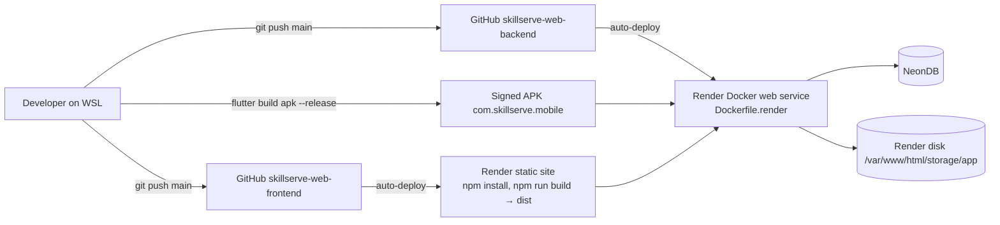

# Deployment & Infrastructure Index

- [[Docker Compose Local Stack]] — the four local containers
- [[Render Backend Service]] · [[PayMongo Setup]] — production container (nginx + PHP + Reverb + queue + scheduler)
- [[Frontend Hosting]] — Render static site (and the Vercel config)
- [[NeonDB]] — production PostgreSQL with pooler/direct hosts
- [[Render Persistent Disk]] — uploads storage
- [[Release Workflow]] — how code reaches production and how to roll back
- [[Go-Live Checklist]] — owner actions before launch
- [[Mobile Release Build]] — signed Android APK

Source doc: root `DEPLOYMENT.md`. Back to [[Home]]
