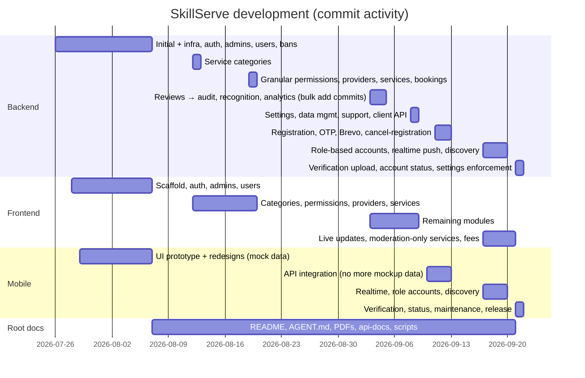

# Commit Timeline

Derived from `git log` of the four repos (dates are commit dates).

## Milestone commits

| Date | Repo | Commit |
|---|---|---|
| 2026-07-26 | backend | Initial Commit; "change into mysql database" (later PostgreSQL) |
| 2026-08-07 | backend | PostgreSQL + Dockerfile; API infrastructure; authentication; administrators; users; bans |
| 2026-08-07 | frontend | Tailwind/daisyUI; routing; auth; role & permission management; user management |
| 2026-08-12 | both | service category management |
| 2026-08-20 | both | provider management; services |
| 2026-09-05 | both | bulk module work (reviews, reports, disputes, notifications, dashboard, analytics, recognition, audit) — terse "add"/"fix" messages |
| 2026-09-08 | both | `feat/system-settings`, `feat/data-management` |
| 2026-09-11 | mobile | "switch to api and connect to backend no more mockup data" |
| 2026-09-12 | backend | registration, SMTP, Brevo API transport, CORS for Vercel |
| 2026-09-17 | all | role-based accounts, provider services, realtime push, live admin updates |
| 2026-09-20 | backend/mobile | discovery filters, provider availability, global search |
| 2026-09-21 | all | verification upload, account status, decision notifications, enforced settings, release setup; docs: go-live checklist |

Totals at audit: root 29, backend 79, frontend 56, mobile 33 commits.

Related: [[Changelog]] · [[Team and Ownership]]
