# Change Control Process

The project has no formal CAB or PR review (work goes straight to `main`). The process below is the
one the repo rulebooks already require, in order.

```mermaid
flowchart LR
  A[Requirement / issue<br/>PDF id, KI id or PENDING_FIXES id] --> B[Inspect existing code<br/>callers, tests, vault notes]
  B --> C[Smallest complete change<br/>backend → frontend/mobile]
  C --> D[Tests + Pint/ESLint/analyze]
  D --> E[Read-only senior review<br/>AGENT_REVIEW.md]
  E --> F[Docs: api-docs, mobile copy,<br/>vault notes, changelog]
  F --> G[Commit on main<br/>conventional message]
  G --> H[Render auto-deploy<br/>check /api/health]
  H --> I[UAT row updated in TEST_PLAN.md]
```

## Rules per change type

| Change | Extra requirements |
|---|---|
| Endpoint added/changed | Swagger attributes; regenerate `api-docs`; copy to mobile; regenerate vault endpoint notes; update callers |
| Migration | explain migration, data impact, deploy order, rollback, backfill; additive where possible; deploy backend first |
| Permission | add to `RolePermissionSeeder` **and** a data migration; update frontend permission strings |
| Setting | add to `config/system-settings.php`; enforce in one service; document in [[System Settings Catalog]] |
| Mobile route | classify in `app_router.dart` role sets |
| Breaking contract | update every caller (admin web + mobile) and the docs in the same release |
| Decision | new ADR ([[Template - ADR]]) |

## Rollback

Render → redeploy previous build; migrations are not rolled back automatically — write them to be
backward-compatible. Mobile: ship a new APK (no remote rollback).

Related: [[Release Workflow]] · [[Documentation Sync Procedure]] · [[Quality Gates]]
