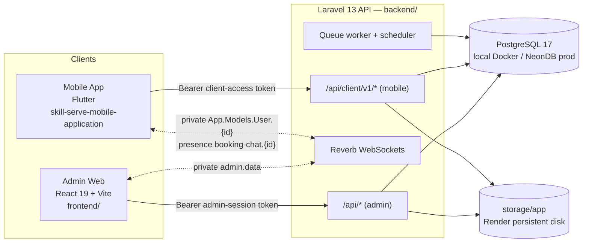

# SkillServe Knowledge Base

The second brain and AI-agent knowledge base for **SkillServe** — a skills marketplace made of a
Laravel API, a React admin web, and a Flutter mobile app for customers and service providers.

> [!important] How to trust this vault
> Every note was written from a read-only audit of the code on **2026-09-22** (backend `711ce52`,
> frontend `main`, mobile `4f03555`, root `078ad87`). Facts cite the file they came from.
> Anything that could not be confirmed from the code is marked **Needs Verification** and listed in
> [[Needs Verification Register]]. When code and a note disagree, **the code wins** — fix the note
> (see [[Documentation Sync Procedure]]).

## Start here

| If you want to… | Read |
|---|---|
| Understand what SkillServe is | [[Project Overview]] · [[Requirements Sources]] · [[Glossary]] |
| See how the pieces fit | [[Architecture Overview]] · [[Module Relationship Map]] |
| Learn the business rules | [[Domain Model Overview]] · [[Booking Lifecycle]] |
| Look up a table | [[Database Index]] · [[Entity Relationship Diagram]] |
| Look up an endpoint | [[API Index]] · [[Endpoints Index]] |
| Check a feature's status | [[Features Index]] · [[Module Completion Matrix]] |
| Run it locally | [[Local Setup]] · [[Environment Variables]] |
| Ship it | [[Release Workflow]] · [[Go-Live Checklist]] |
| Fix something | [[Troubleshooting Index]] · [[Known Issues and Gaps]] |
| Work as an AI agent | [[AI Agent Guide]] · [[Coding Conventions]] |

## Map of the vault

| Folder | Index | What lives there |
|---|---|---|
| 00 - Project Foundation | [[Project Foundation Index]] | Vision, requirements, repos, stack, glossary |
| 01 - System Architecture | [[System Architecture Index]] | Backend, admin web, mobile, realtime, storage, jobs |
| 02 - Domain & Business Logic | [[Domain Index]] | Entities, lifecycles, rules, settings |
| 03 - Database | [[Database Index]] | Schema overview, ERD, migrations, one note per table |
| 04 - API Integrations | [[API Index]] | Conventions, auth flows, realtime, integrations, generated endpoint notes |
| 05 - Features & Modules | [[Features Index]] | Admin Web, Client Mobile and Provider Mobile features |
| 06 - UI UX | [[UI UX Index]] | Design systems, layouts, navigation |
| 07 - Security | [[Security Index]] | AuthN, RBAC, tokens, rate limits, uploads, audit, findings |
| 08 - Development | [[Development Index]] | Setup, env, conventions, workflows, AI agent guide |
| 09 - Testing & QA | [[Testing Index]] | Strategy, suites, UAT traceability, quality gates |
| 10 - Deployment & Infrastructure | [[Deployment Index]] | Docker, Render, NeonDB, disk, releases |
| 11 - Architecture Decisions | [[ADR Index]] | Architecture Decision Records |
| 12 - Troubleshooting | [[Troubleshooting Index]] | Known problems and fixes |
| 13 - Project Management | [[Project Management Index]] | Status, completion, roadmap, timeline |
| 14 - Change Management | [[Change Management Index]] | Changelog, sync procedure, change control |
| 99 - Meta | [[Vault Guide]] | Vault rules, templates, scripts, verification register, audit report |

## The system in one picture

## Latest audit

- [[Audit Report 2026-09-22]] — how this vault was built and the headline findings.
- [[Known Issues and Gaps]] — defects and inconsistencies found in the code.
- [[Needs Verification Register]] — open questions the code could not answer.
